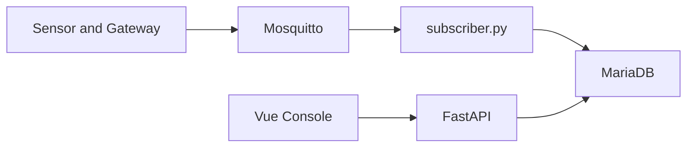

# 333 IOT Console Engineering Improvement Plan

Document version: 0.1  
Date: 2026-08-03  
Status: Planning document; implementation has not started

## 1. Goals and scope

This document records the work required to evolve the current MQTT / FastAPI / Vue / MariaDB demo into a reliable, maintainable and auditable production system.

Primary goals:

- Prevent data loss during MQTT disconnects, reconnects and Gateway store-and-forward replay, while preventing QoS 1 duplicates.
- Establish multi-tenant isolation and permissions for internal administrators and read-only employees.
- Move buildings, floors, rooms, devices and floor models from frontend demo state into authoritative database records.
- Support approximately eight different floor types, each with its own model, room geometry, room data and device layout.
- Provide observability, backup, migration, testing and rollback processes.

Assumptions:

- Tenants do not log into this system directly.
- Internal administrators and read-only employees are authenticated and authorized by role and resource scope.
- Gateways / devices provide the primary offline Store-and-Forward mechanism; the backend handles replay bursts, deduplication, persistence and status tracking.

## 2. Current baseline and major gaps

The current data flow is:



Current implementation references:

- [`mqttapi/subscriber.py`](mqttapi/subscriber.py): synchronously decodes and writes each MQTT message from the Paho callback.
- [`mqttapi/app/db.py`](mqttapi/app/db.py): creates a database connection for each message and uses autocommit.
- [`mqttapi/sql/init.sql`](mqttapi/sql/init.sql) and [`mqttapi/sql/init_ug65.sql`](mqttapi/sql/init_ug65.sql): mainly define the `tof` and `ug65` telemetry tables, without source-event uniqueness keys.
- [`frontend/src/stores/building.ts`](frontend/src/stores/building.ts): stores floor, room and device assignments in frontend memory.
- [`frontend/src/utils/buildingDemo.ts`](frontend/src/utils/buildingDemo.ts): contains fixed floor counts, room cells, model assumptions and deterministic demo metrics.
- [`frontend/src/views/DevicesManageView.vue`](frontend/src/views/DevicesManageView.vue): device management currently modifies only the frontend store.
- [`mqttapi/app/api/main.py`](mqttapi/app/api/main.py): currently has no login, RBAC, tenant scope or resource-level authorization.

## 3. P0: data reliability and security foundations

### 3.1 MQTT connection and subscriptions

- Use a fixed and unique subscriber `client_id`.
- Use a persistent MQTT session with MQTT v3 `clean_session=False`.
- Keep QoS 1 and configure broker persistence, offline queue limits, message expiry and disk limits.
- Add `on_disconnect`, `on_subscribe`, reconnect counters, last connection time and last successful subscription time.
- Re-subscribe after every reconnect and verify SUBACK; do not treat a printed “Subscribed” message as confirmation.
- Use exponential backoff with jitter so all services do not retry at the same time during a broker outage.
- Ensure that only one production subscriber instance runs in an environment.

### 3.2 Durable inbox, retries and dead letters

The MQTT callback should not perform long-running database writes. The target flow is:

```text
MQTT message
  -> validate envelope
  -> durable inbox
  -> deduplicate
  -> decode and normalize
  -> batch database write
  -> mark processed
```

Recommended additions:

- `mqtt_inbox`: raw message, topic, source, receive time, processing status and error details.
- `mqtt_dead_letters`: messages that cannot be decoded, persistently fail database writes or are incompatible with the schema.
- A bounded queue and queue-depth metric to prevent replay bursts from exhausting memory.
- Exponential-backoff retries for transient database errors.
- Reprocessing by cursor, time range or message ID.

Gateway Store-and-Forward remains the primary offline replay mechanism. The backend still needs a durable inbox to cover the window where the subscriber has received an MQTT message but has not completed the database commit.

### 3.3 Idempotency and duplicate data

QoS 1 is at-least-once delivery, not exactly-once delivery. Each protocol needs a source-event key:

- UG65 / UG56: `gateway_id + dev_eui + session + f_cnt`, with a payload hash for conflict detection.
- VS135 / TOF: device serial number, source frame counter, device event time and payload hash; do not use only `received_at`.
- If the device provides a native message ID, prefer that ID.

Use unique indexes and `INSERT ... ON DUPLICATE KEY UPDATE` or equivalent upsert logic. Store `dup`, `retain`, source sequence values and decoder version for troubleshooting.

### 3.4 Time semantics

All services should store and transmit UTC:

- `event_time`: the time measured by the device or reported by the Gateway.
- `received_at`: the time the service received the MQTT message.
- `ingest_lag`: the difference between the two.

Charts and historical queries should primarily use `event_time`; connection status, freshness and monitoring should use `received_at`. Convert to Hong Kong time only at the presentation layer.

### 3.5 Production security

- Rotate development credentials that are tracked or have been exposed.
- Use a dedicated database account in production, never root.
- Enable MQTT TLS, authentication, topic ACLs and tenant/device topic scope.
- Use HTTPS for the API and an explicit CORS allowlist.
- Protect or disable `/docs`, `/openapi.json` and the MQTT connectivity test in production.
- Require authentication and deny-by-default authorization for all APIs.

## 4. P1: multi-tenancy, permissions and management master data

### 4.1 Roles and resource scope

Recommended roles:

- `system_admin`: manages all tenants, buildings, floors, rooms, devices, users and audit records.
- `tenant_operator`: manages devices and rooms inside assigned tenant scopes.
- `employee_viewer`: reads data inside assigned tenant, building or floor scopes.

Tenants do not log in, but every master-data record and telemetry record must have a `tenant_id`. The backend must derive tenant scope from the authenticated user and must not trust a client-supplied `tenant_id`.

### 4.2 Recommended master-data tables

- `tenants`
- `users`
- `roles`
- `permissions`
- `user_roles`
- `user_resource_scopes`
- `buildings`
- `floors`
- `rooms`
- `devices`
- `gateways`
- `device_room_assignments`
- `mqtt_topic_bindings`
- `audit_logs`

`tof` and `ug65` telemetry should reference a canonical `device_id`, rather than relying only on string searches for `device_sn` or `dev_eui`.

### 4.3 Backend and frontend authorization

The backend must implement:

- A `current_user` dependency.
- Route-level permissions such as `device:read`, `device:manage`, `room:manage` and `mqtt:test`.
- Resource-level tenant, building, floor and room scope checks.
- Protection against enumeration through sequential resource IDs.
- Audit logs for every write, delete, configuration and MQTT test operation.

The frontend should implement:

- Login, logout and session / refresh-token handling.
- Router guards and route permission metadata.
- Consistent 401 and 403 handling.
- No management controls available to `employee_viewer`.

Hiding buttons in the frontend is not a replacement for backend authorization.

## 5. P1: database-backed floor types, models and room data

### 5.1 Current problem

[`buildingDemo.ts`](frontend/src/utils/buildingDemo.ts) currently uses:

- A fixed `FLOOR_COUNT`.
- One fixed `FLOOR_ROOMS` definition.
- Fixed grid rows, columns and room cells.
- Fixed room colors and geometry.
- Fixed demo device assignments.
- Floor-number-based deterministic demo values.

The real building has approximately eight different floor types, so every floor cannot share one room and model definition.

### 5.2 Target data model

Recommended additions:

- `floor_types`: floor-type name, description and version.
- `floor_type_templates`: default rooms, cells and device-layout templates for a floor type.
- `buildings`: building master data.
- `building_floors`: floor instance, floor number, sort order and `floor_type_id`.
- `floor_models`: model asset, version, checksum, units, coordinate system, scale, origin, rotation and asset URL.
- `rooms`: actual rooms belonging to a `building_floor_id`.
- `room_layout_versions`: layout version, publication status and editor.
- `room_geometry` or `room_cells`: polygons, grid cells, entrances, coordinates and display settings.
- `device_room_assignments`: device-to-room relation and effective interval.

### 5.3 Template and floor-instance relationship

A floor type should be used as a template when creating a floor instance:

1. An administrator selects a `floor_type` to create a real floor.
2. The system copies the model version, rooms and default geometry.
3. The real floor stores its own rooms, model version and device assignments.
4. Later template changes must not automatically overwrite published floors.
5. Synchronization must use an explicit migration, diff preview and administrator approval.

This keeps the eight floor types independent and prevents a room change on one floor from affecting other floors.

### 5.4 Model asset management

Each floor model should record:

- Asset path or object-storage URL.
- Model version.
- Checksum.
- Units and coordinate system.
- Scale, origin, rotation and floor height.
- Import time, importer and status.
- Compatible frontend renderer version.

The frontend should load only published model and layout versions and provide a safe fallback if an asset fails to load. Model selection, room positions and floor differences must not remain hard-coded in `buildingDemo.ts`.

### 5.5 Recommended APIs

- `GET /api/v1/buildings`
- `GET /api/v1/buildings/{building_id}/floors`
- `GET /api/v1/floor-types`
- `POST/PATCH /api/v1/floor-types`
- `GET /api/v1/floors/{floor_id}/model`
- `PUT /api/v1/floors/{floor_id}/model`
- `GET /api/v1/floors/{floor_id}/rooms`
- `POST/PATCH/DELETE /api/v1/rooms`
- `PUT /api/v1/rooms/{room_id}/layout`
- `PUT /api/v1/rooms/{room_id}/devices/{device_id}`
- `DELETE /api/v1/rooms/{room_id}/devices/{device_id}`

## 6. P1: publish, subscribe and device-status management

The current production flow has a subscriber but no reliable publisher command pipeline. Add:

- `mqtt_topic_bindings`: device, Gateway, tenant, direction, topic, QoS and ACL.
- `mqtt_commands` or `command_outbox`: command ID, status, retries, timeout, operator and response.
- A publisher worker rather than waiting for MQTT publication inside an HTTP request.
- Command audit logs.
- Device heartbeat, `last_seen`, `last_event_at`, `ingest_lag` and offline status.
- Connectivity tests restricted to registered devices, administrators and rate limits.

Gateway / device replay batches should provide:

- Batch ID.
- Source sequence for each event.
- Original event time.
- Source device and Gateway.
- Batch completion or partial-failure status.

## 7. P1/P2: API, frontend and operations stability

### API

- Connection pooling, timeouts, batch queries and safe retries.
- Enforced page sizes, maximum time ranges and cursor pagination.
- Response field allowlists; do not expose raw messages, internal IPs or unnecessary fields.
- A consistent error envelope, request IDs and structured logging.
- Liveness, readiness, subscriber heartbeat and metrics.

### Frontend

- Axios request and response interceptors.
- Redirect 401 responses to login and show a permission page for 403 responses.
- Limited retries for GET requests, cancellation of stale requests and protection against old requests overwriting newer state.
- Display last uplink time, data lag, replay status and device offline status.
- Load and save building and room data through the API; do not use Pinia demo state as the source of truth.

### Database and deployment

- Versioned migrations; do not alter schemas unpredictably during service startup.
- Raw-payload retention, archive, partitioning and capacity alerts.
- MariaDB full backups, binlog / PITR and regular restore drills.
- API and subscriber releases pinned to the same version with rollback support.
- systemd network readiness, service watchdogs and no-data alerts.
- Locked or constrained Python dependencies to avoid version drift.

## 8. Testing and acceptance criteria

No formal automated test suite was found. At minimum, add:

- Decoder unit tests.
- MQTT disconnect and reconnect tests.
- Broker and MariaDB outage recovery tests.
- QoS 1 redelivery tests proving no duplicate rows.
- Gateway batch replay and partial-failure tests.
- Tenant-scope, administrator and employee-viewer API tests.
- Floor-type, model-version, room-layout and migration tests.
- Frontend login, permission-guard and floor-model-loading E2E tests.
- Load tests and fault injection for full disks, exhausted DB connections and broker restarts.

Completion criteria:

- Messages can be processed after MariaDB becomes available again.
- QoS 1 redelivery, subscriber restart and Gateway replay do not create duplicate telemetry.
- An employee cannot manage devices, rooms, models or MQTT operations.
- Cross-tenant queries are rejected.
- All eight floor models can be loaded independently.
- Room configurations on different floor instances do not contaminate each other.
- Room and model changes have versions, actors and audit trails.
- A database backup can be restored and its integrity verified.

## 9. Implementation order

### P0

1. Credential rotation, TLS, MQTT ACL, CORS and authentication foundations.
2. MQTT persistent sessions, reconnects, durable inbox, idempotency keys and retries.
3. UTC and separation of event time from receive time.
4. Subscriber health, metrics and no-data alerts.

### P1

1. Multi-tenancy, internal users and administrator / employee-viewer RBAC.
2. Building, floor-type, building-floor, room and device master data and APIs.
3. Versioned database models for eight floor types, floor assets and room layouts.
4. Frontend login, router guards, API error handling and dynamic floor loading.
5. MQTT topic bindings, publisher outbox and command auditing.

### P2

1. Backup and restore, retention, archive and partitioning.
2. Load, fault-injection, full E2E and security testing.
3. Model-asset optimization, caching, diff migrations and batch-management tools.

This document records engineering-improvement directions only. None of the implementation work above has been executed.
