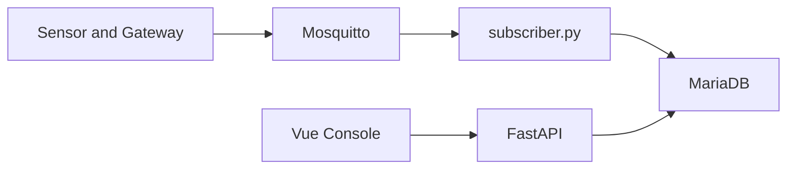

# 333 IOT Console 工程化改進計畫

文件版本：0.1  
日期：2026-08-03  
狀態：規劃文件，尚未執行實作

## 1. 目標與範圍

本文件記錄將目前 Demo 級別的 MQTT／FastAPI／Vue／MariaDB 專案提升至可長期運行、可維護及可審計系統所需的工作。

主要目標：

- MQTT 斷線、重連、Gateway 離線補傳時不遺失資料，並避免 QoS 1 重送造成重複。
- 建立多租戶資料隔離及內部管理人員／員工權限。
- 將樓宇、樓層、房間、設備及樓層模型由前端示範資料改為資料庫主資料。
- 支援約 8 種不同樓層類型，每種樓層可有不同模型、房間幾何、房間資料及設備配置。
- 提供可觀測性、備份、遷移、測試及可回滾部署流程。

前提：

- 租戶本身不直接登入系統。
- 系統內部管理人員及只讀員工需要按照角色和資料範圍授權。
- Gateway／設備負責主要的離線 Store-and-Forward；後端負責接收突發補傳、去重、入庫及狀態追蹤。

## 2. 目前基線與主要缺口

目前資料流程是：



現有實作參考：

- [`mqttapi/subscriber.py`](mqttapi/subscriber.py)：Paho MQTT callback 內同步解碼及寫入資料庫。
- [`mqttapi/app/db.py`](mqttapi/app/db.py)：每筆訊息建立資料庫連線並使用 autocommit。
- [`mqttapi/sql/init.sql`](mqttapi/sql/init.sql) 與 [`mqttapi/sql/init_ug65.sql`](mqttapi/sql/init_ug65.sql)：目前主要只有 `tof`、`ug65` telemetry table，沒有來源事件唯一鍵。
- [`frontend/src/stores/building.ts`](frontend/src/stores/building.ts)：樓層、房間及設備配置只存在前端記憶體。
- [`frontend/src/utils/buildingDemo.ts`](frontend/src/utils/buildingDemo.ts)：固定樓層數、房間格位、模型假設及 deterministic demo metrics。
- [`frontend/src/views/DevicesManageView.vue`](frontend/src/views/DevicesManageView.vue)：設備管理目前只修改前端 Store。
- [`mqttapi/app/api/main.py`](mqttapi/app/api/main.py)：目前沒有登入、RBAC、租戶 scope 或 resource-level authorization。

## 3. P0：資料可靠性與安全基礎

### 3.1 MQTT 連線與訂閱

- 使用固定且唯一的 subscriber `client_id`。
- 使用 persistent MQTT session，MQTT v3 設定 `clean_session=False`。
- 保持 QoS 1，並設定 Broker persistence、離線佇列上限、訊息過期時間及磁碟容量限制。
- 加入 `on_disconnect`、`on_subscribe`、重連次數、最後連線時間及最後成功訂閱時間。
- 每次重連重新訂閱並檢查 SUBACK，不可只印出「Subscribed」。
- 使用 exponential backoff 加 jitter，避免 Broker 故障時所有服務同時重試。
- 確保同一環境只運行一個正式 subscriber。

### 3.2 Durable inbox、重試及 Dead Letter

MQTT callback 不應直接承擔長時間資料庫寫入。目標流程：

```text
MQTT message
  -> validate envelope
  -> durable inbox
  -> deduplicate
  -> decode and normalize
  -> batch database write
  -> mark processed
```

建議新增：

- `mqtt_inbox`：保存原始訊息、topic、來源、接收時間、處理狀態及錯誤。
- `mqtt_dead_letters`：無法解碼、資料庫持續失敗或 schema 不相容的訊息。
- 有界佇列及 queue depth，避免補傳突發流量耗盡記憶體。
- 暫時性資料庫錯誤的指數退避重試。
- 可依 cursor、時間範圍及訊息 ID 重新處理 dead letter。

Gateway Store-and-Forward 是主要離線補傳機制；後端仍需要 durable inbox，避免 subscriber 在「已收到 MQTT 訊息但尚未完成資料庫提交」的短窗口內崩潰而遺失資料。

### 3.3 冪等與重複資料

QoS 1 是至少一次傳送，不等於只傳一次。每種協定需要定義來源事件鍵：

- UG65／UG56：`gateway_id + dev_eui + session + f_cnt`，並保留 payload hash 作為衝突檢查。
- VS135／TOF：使用設備序號、來源 frame counter、設備事件時間及 payload hash；不可只使用 `received_at`。
- 若設備提供原生 message ID，優先使用原生 ID。

資料庫應以 unique index 加上 `INSERT ... ON DUPLICATE KEY UPDATE` 或等價 upsert 實現冪等，並保存 `dup`、`retain`、來源序號及 decoder version。

### 3.4 時間語義

所有服務使用 UTC 儲存及傳輸：

- `event_time`：設備實際量測或 Gateway 上報時間。
- `received_at`：服務收到 MQTT 訊息的時間。
- `ingest_lag`：兩者差異。

圖表及歷史查詢以 `event_time` 為主；連線狀態、資料延遲及監控以 `received_at` 為主。前端顯示香港時間時才進行轉換。

### 3.5 生產安全

- 移除及輪換已被追蹤或曾經暴露的開發帳密。
- 生產環境使用專用資料庫帳號，不使用 root。
- MQTT 啟用 TLS、帳號 ACL 及 topic scope。
- API 使用 HTTPS，CORS 使用明確 allowlist。
- `/docs`、`/openapi.json` 及 MQTT connectivity test 必須保護或在正式環境關閉。
- 所有 API 使用認證及 deny-by-default 授權。

## 4. P1：多租戶、權限及管理主資料

### 4.1 角色及資料範圍

建議角色：

- `system_admin`：管理所有租戶、樓宇、樓層、房間、設備、帳號及審計紀錄。
- `tenant_operator`：管理被指派租戶範圍內的設備及房間。
- `employee_viewer`：只讀取被授權的租戶、樓宇或樓層資料。

租戶不登入，但每筆主資料及 telemetry 必須帶有 `tenant_id`。後端從登入者的 scope 取得租戶範圍，不可相信前端傳入的 `tenant_id`。

### 4.2 建議主資料表

- `tenants`
- `users`
- `roles`
- `permissions`
- `user_roles`
- `user_resource_scopes`
- `buildings`
- `floors`
- `rooms`
- `devices`
- `gateways`
- `device_room_assignments`
- `mqtt_topic_bindings`
- `audit_logs`

`tof` 及 `ug65` telemetry 應關聯 canonical `device_id`，不可只依賴 `device_sn` 或 `dev_eui` 字串搜尋。

### 4.3 後端與前端權限

後端必須實施：

- `current_user` dependency。
- route-level permission，例如 `device:read`、`device:manage`、`room:manage`、`mqtt:test`。
- tenant／building／floor／room 的 resource-level scope。
- 未授權資源不可透過 sequential ID 枚舉。
- 所有寫入、刪除、配置及 MQTT 測試記錄 audit log。

前端應實施：

- 登入、登出、session／refresh token 管理。
- router guard 及 route permission metadata。
- 401／403 統一處理。
- employee 不顯示或不可執行任何管理按鈕。

前端隱藏按鈕不能代替後端授權。

## 5. P1：樓層類型、模型及房間資料庫化

### 5.1 現況問題

目前 [`buildingDemo.ts`](frontend/src/utils/buildingDemo.ts) 使用：

- 固定 `FLOOR_COUNT`。
- 一套固定 `FLOOR_ROOMS`。
- 固定 grid row／column 及房間格位。
- 固定房間顏色及幾何。
- 固定 demo 設備配置。
- 由 floor number 產生示範數值。

實際建築物約有 8 種不同樓層類型，因此不能讓所有樓層共用同一套房間及模型定義。

### 5.2 目標資料模型

建議新增：

- `floor_types`：樓層類型名稱、描述及版本。
- `floor_type_templates`：該類型的預設房間、格位及設備配置模板。
- `buildings`：建築物基本資料。
- `building_floors`：實際樓層實例、樓層號碼、排序及所屬 `floor_type_id`。
- `floor_models`：模型資產、版本、checksum、單位、座標系統、scale、origin、rotation 及 asset URL。
- `rooms`：實際樓層內的房間，屬於 `building_floor_id`。
- `room_layout_versions`：房間配置版本、發布狀態及修改人。
- `room_geometry` 或 `room_cells`：多邊形、grid cells、門口、座標及顯示設定。
- `device_room_assignments`：設備與實際房間的關聯及生效時間。

### 5.3 模板與實際樓層的關係

樓層類型只能作為建立新樓層時的模板：

1. Admin 選擇一種 `floor_type` 建立實際樓層。
2. 系統複製該類型的模型版本、房間及預設幾何。
3. 實際樓層保存自己的房間、模型版本及設備配置。
4. 後續模板更新不可自動覆蓋已發布樓層。
5. 若需要同步，必須建立明確 migration、diff 預覽及管理員確認。

這樣可以確保 8 種樓層類型互相獨立，也避免修改一層的房間影響其他樓層。

### 5.4 模型資產管理

每個樓層模型應記錄：

- asset path 或 object storage URL。
- model version。
- checksum。
- 尺寸單位及座標系統。
- scale、origin、rotation 及樓層高度。
- 匯入時間、匯入者及狀態。
- compatible frontend renderer version。

前端只取得已發布的模型及 layout 版本，並支援載入失敗時的安全 fallback。不能再把模型選擇、房間位置及樓層差異寫死在 `buildingDemo.ts`。

### 5.5 建議 API

- `GET /api/v1/buildings`
- `GET /api/v1/buildings/{building_id}/floors`
- `GET /api/v1/floor-types`
- `POST/PATCH /api/v1/floor-types`
- `GET /api/v1/floors/{floor_id}/model`
- `PUT /api/v1/floors/{floor_id}/model`
- `GET /api/v1/floors/{floor_id}/rooms`
- `POST/PATCH/DELETE /api/v1/rooms`
- `PUT /api/v1/rooms/{room_id}/layout`
- `PUT /api/v1/rooms/{room_id}/devices/{device_id}`
- `DELETE /api/v1/rooms/{room_id}/devices/{device_id}`

## 6. P1：發布、訂閱及設備狀態管理

目前正式流程只有 subscriber，沒有可靠的 publisher command pipeline。應新增：

- `mqtt_topic_bindings`：設備、Gateway、租戶、方向、topic、QoS 及 ACL。
- `mqtt_commands` 或 `command_outbox`：指令 ID、狀態、重試、timeout、操作者及回應。
- publisher worker：不在 HTTP request 內直接等待 MQTT 發布。
- command audit log。
- device heartbeat、last_seen、last_event_at、ingest_lag 及 offline status。
- 設備註冊後才允許 connectivity test，並加上 admin-only 及 rate limit。

Gateway／設備補傳的批次格式必須有：

- 批次 ID。
- 每筆事件的來源序號。
- 原始 event time。
- 來源設備及 Gateway。
- 批次完成或部分失敗狀態。

## 7. P1/P2：API、前端及營運穩定性

### API

- 連線池、timeout、批量查詢及安全重試。
- 強制 page size、最大時間範圍、cursor pagination。
- response field allowlist，不直接回傳 raw message、內部 IP 或不必要欄位。
- 統一 error envelope、request ID 及 structured logging。
- liveness、readiness、subscriber heartbeat 及 metrics。

### 前端

- Axios request／response interceptor。
- 401 自動導向登入，403 顯示無權限頁面。
- GET 查詢有限度 retry、取消過期請求及避免舊請求覆蓋新狀態。
- 顯示最後上報時間、資料延遲、補傳狀態及設備離線狀態。
- 樓宇及房間資料改由 API 載入及保存，不再以 Pinia demo state 作為真實來源。

### 資料庫及部署

- 使用版本化 migration，不在服務啟動時隨意修改 schema。
- raw payload retention、archive、partition 及容量告警。
- MariaDB full backup、binlog／PITR 及定期還原演練。
- API 與 subscriber 使用同一版本、可回滾 release。
- systemd 加入 network readiness、服務 watchdog 及 subscriber 無資料告警。
- Python dependencies 使用 lock 或 constraints，避免版本漂移。

## 8. 測試及驗收條件

目前未發現正式自動化測試套件。至少需要：

- decoder 單元測試。
- MQTT 斷線及重連測試。
- Broker 或 MariaDB 暫停後的恢復測試。
- QoS 1 重送不產生重複列的測試。
- Gateway 批量補傳及部分失敗測試。
- tenant scope、admin、employee viewer 的 API 測試。
- floor type、模型版本、房間配置 migration 測試。
- 前端登入、權限守衛及樓層模型載入 E2E 測試。
- 壓測、磁碟滿、DB 連線耗盡及 Broker 重啟故障注入測試。

完成標準：

- DB 暫停後恢復服務，訊息可重新處理。
- QoS 1 重送、subscriber 重啟及 Gateway replay 不產生重複 telemetry。
- employee 無法執行設備、房間、模型及 MQTT 管理操作。
- 跨租戶查詢被拒絕。
- 8 種樓層模型可獨立載入。
- 每個實際樓層的房間配置互不污染。
- 修改房間或模型有版本、操作者及 audit trail。
- 可從備份完成資料庫還原並驗證資料完整性。

## 9. 實施順序

### P0

1. 憑證輪換、TLS、MQTT ACL、CORS 及 API 認證基礎。
2. MQTT persistent session、重連、durable inbox、冪等鍵及失敗重試。
3. UTC、event time／received time 分離。
4. subscriber health、metrics 及無資料告警。

### P1

1. 多租戶、內部使用者、admin／employee viewer RBAC。
2. Building、floor type、building floor、room、device 主資料及管理 API。
3. 8 種樓層模型及房間 layout 的版本化資料庫模型。
4. 前端登入、router guard、API error handling 及動態樓層載入。
5. MQTT topic binding、publisher outbox 及指令審計。

### P2

1. 備份還原、retention、archive、partition。
2. 壓測、故障注入、完整 E2E 及安全測試。
3. 模型資產最佳化、快取、diff migration 及批次管理工具。

本文件只記錄工程化改進方向；目前尚未執行上述實作。
