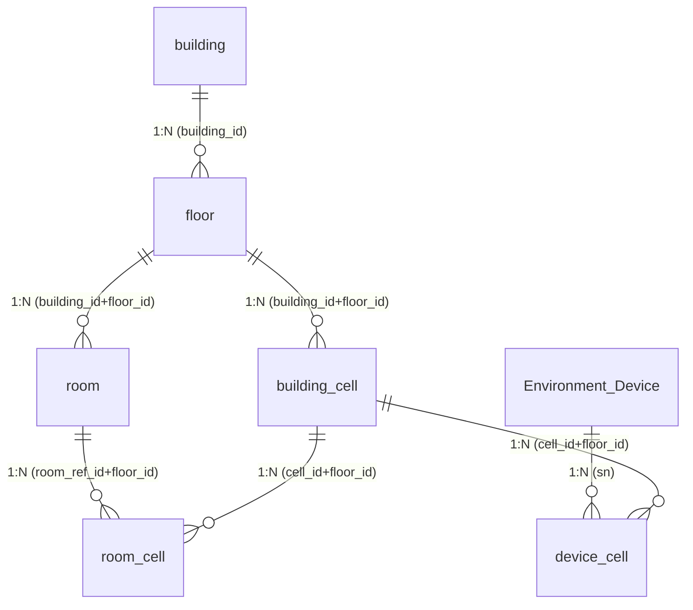

# WingOnIOT · 大厅概念 / 软删支持 / 格子关联设备风险分析

> 基于当前 `WingOnIOT_DDL_Data.sql`、`mqttapi/sql/migrate_device_cell.sql` 与 `mqttapi/app/db.py` 代码梳理。
> 结论：「大厅」是查询时**隐式派生**的概念；DDL 依赖 `is_deleted` 软删，但关联表（`room_cell` / `device_cell`）没有软删字段，存在若干隐藏风险。

---

## 一、"大厅"概念：DDL 是否支持

**结论：DDL 没有独立的"大厅"实体或字段，"大厅"是查询时隐式派生出来的概念**——它指"有效格子（`building_cell.is_deleted=0`）但未被任何有效房间占用（`room_cell` 无记录，或对应 `room` 已软删）的格子"。

- 判定链路（代码证据）：`db.list_environment_devices` 里 `rrc` 子查询 `JOIN room r ON r.id = rc.room_ref_id AND r.is_deleted = 0` 反查 `room_id`；前端 `FloorViewerView` 的 `lobbyDevices = d.cell && (!d.room_id || !deviceRoomIds.has(d.room_id))`。
- `building_cell.shape='Hidden'` / `is_active=0` 只控制**渲染隐藏**，不是大厅的业务标记。

**软删（is_deleted）体系下是否支持：基本支持，但依赖查询过滤而非数据清理。**

| 场景 | 行为 |
|---|---|
| 软删房间（`room.is_deleted=1`） | `room_cell` 记录**不删**（该表无 `is_deleted`，FK 只在硬删时 CASCADE），但所有查询都过滤 `room.is_deleted=0` → 该房间占的格子反查不到 `room_id` → 格子（及其上的设备）自动变成"大厅"。✅ 逻辑上支持 |
| 恢复房间（un-delete） | `room_cell` 残留记录自动重新生效，格子回到房间占用，无需重建。✅ 软删的好处 |
| 硬删房间（DELETE） | `room_cell` 被 FK CASCADE 清掉，格子变大厅。行为与软删一致，但数据更干净 |

**关键缺口**：`room_cell`、`device_cell` 两张关联表**没有 `is_deleted` 字段**，软删不会清理它们——"软删"的效力完全靠查询层过滤。这是设计上的不一致点（见风险 R1/R4）。

---

## 二、"格子关联设备"的隐藏风险梳理

设备↔格子链路：`Environment_Device(sn)` —`device_cell(sn, cell_id, floor_id)`— `building_cell(id, floor_id)`，两端 FK 都是 `ON DELETE CASCADE`（**仅硬删触发**）。

- **R1｜软删格子 → `device_cell` 残留**：软删格子行还在，FK 不触发，绑定残留。已加 `cell_lost` 让 UI 可区分、可一键清理；但残留行**不会自动清除**，长期会累积脏数据。
- **R2｜"软删+重建"同坐标格子 → 绑定漂移**：`building_cell` 的 `UNIQUE uk_cell (floor_id,row_no,col_no,is_deleted)` 允许同坐标存在"旧软删行+新 active 行"。旧行上的 `device_cell` 显示 `cell_lost`，而 `find_cell_by_row_col` 只会命中新行 → 用户重新绑定时绑的是新行，旧残留仍在，容易误以为"没绑上"。
- **R3｜DB 层无"一格一房"约束**：`room_cell` 的 `UNIQUE (room_ref_id,floor_id,cell_id)` 只防同房间重复，**不防一格被多个房间占用**。目前靠前端 `assignRoomCell` 先释放再占用保证；绕过前端直插 SQL 会造成一格多房，而大厅判定里的 `MIN(room_id)` 会静默取一个，统计混乱。
- **R4｜软删房间 → 设备归属静默漂移**：房间软删后其格子变大厅，绑定在格子上的设备自动从"房间设备"变"大厅设备"（`room_id` 变 null），**无联动、无提示**。误删时设备归属信息悄悄丢失。
- **R5｜硬删/软删不对称**：硬删格子 → `device_cell`、`room_cell` 级联清干净；软删 → 都不清。业务混用两种删除时数据状态会不一致。
- **R6｜`Environment_Device` 无 `is_deleted`**：设备"删除"只能是硬删（DELETE，`device_cell` 级联清）。若未来要软删设备需加字段并处理残留。
- **R7｜`device_cell` "一设备多格"语义与实际不符**：表注释写"一设备可對多格"，但 `bind_device_cell` 是替换语义（DELETE 后 INSERT 一条）、`list` 取 `rn=1` 最新一条，实际是"一设备一格"。若想真做多格覆盖需改表与查询。
- **R8｜DDL dump 缺表**：`WingOnIOT_DDL_Data.sql` 没有 `device_cell`（由 `mqttapi/sql/migrate_device_cell.sql` 单独建）。全新初始化只跑 dump 会缺表。
- **R9｜业务层目前无"级联软删"**：`db.py` 只有 `building_cell` 的软删操作；`building/floor/room` 虽有 `is_deleted` 字段但当前 API 层没有删除入口，也没有"软删房子→联动软删楼层/格子/房间"的逻辑。将来加删除功能时必须补联动，否则会出现"房子没了、格子还在"。

---

## 三、DDL 关联关系图

### Mermaid 图



### ASCII 图

```
┌──────────────────────┐
│ building（房子）      │  id, name, code, address
│  └ is_deleted(软删)   │
└──────────┬───────────┘
           │ 1:N  FK building_id (CASCADE)
┌──────────▼───────────┐
│ floor（楼层）          │  id, building_id, row_amount, column_amount,
│  └ is_deleted(软删)   │  level(-2..9), floor_name
└──────┬─────────┬─────┘
       │ 1:N     │ 1:N
       │ FK      │ FK (building_id, floor_id)  ← 复合外键，保证同楼同层
┌──────▼──────┐ ┌▼─────────────────┐
│ building_cell│ │ room（房间）      │
│ （格子）     │ │  └ room_id(UUID) │
│ ┌软删+重建  │ │  └ is_deleted    │
│ 可同坐标两行│ │                  │
│ shape/is_active│ └────────────────┘
└──┬─────┬────┘        │
   │     │             │ 1:N FK (room_ref_id, floor_id)
   │     │        ┌────▼───────┐
   │     │        │ room_cell   │  ← 无 is_deleted！软删不清理
   │     │        │ 一格可多房  │     FK 仅硬删 CASCADE
   │     │        └────┬───────┘
   │     │             │ FK (cell_id, floor_id)
   │     │   ┌─────────┴──────────┐
   │     └──►│ 大厅 = 有效格子且    │
   │         │ room_cell 无有效记录│  （隐式派生，无表无字段）
   │         └────────────────────┘
   │ 1:N FK (cell_id, floor_id)
┌──▼───────────────┐
│ device_cell       │  ← 无 is_deleted！
│ (sn,cell_id,floor_id)│  UNIQUE(sn,cell_id,floor_id)
│ FK→Environment_Device(sn) CASCADE
│ FK→building_cell(id,floor_id) CASCADE
└──┬───────────────┘
   │ 1:N (sn)
┌──▼────────────────┐
│ Environment_Device │  sn(PK), name, model, floor, location,
│  无 is_deleted     │  macAddress
└───────────────────┘
```

### 字段 / 约束要点

| 表 | 主键 | 软删 | 关键约束 | 说明 |
|---|---|---|---|---|
| `building` | id | ✅ `is_deleted` | `UNIQUE(code, is_deleted)` | 房子 |
| `floor` | id | ✅ | `UNIQUE(building_id, level, is_deleted)` | 楼层，level=-2..9 |
| `building_cell` | id | ✅ | `UNIQUE(floor_id,row_no,col_no,is_deleted)`；`FK(building_id,floor_id)→floor` CASCADE | 格子；**UNIQUE 含 is_deleted → 软删后同坐标可重建（R2）** |
| `room` | id | ✅ | `room_id(UUID)` 唯一；`UNIQUE(building_id,floor_id,room_number,is_deleted)`；FK 双向外键 CASCADE | 房间 |
| `room_cell` | id | ❌ 无 | `UNIQUE(room_ref_id,floor_id,cell_id)`；双 FK CASCADE | 房间↔格子；**只防同房重复，不防一格多房（R3）** |
| `Environment_Device` | sn | ❌ 无 | — | 设备，sn 即主键 |
| `device_cell` | id | ❌ 无 | `UNIQUE(sn,cell_id,floor_id)`；双 FK CASCADE | 设备↔格子；**软删格子残留（R1）**，不在主 DDL dump（R8） |
