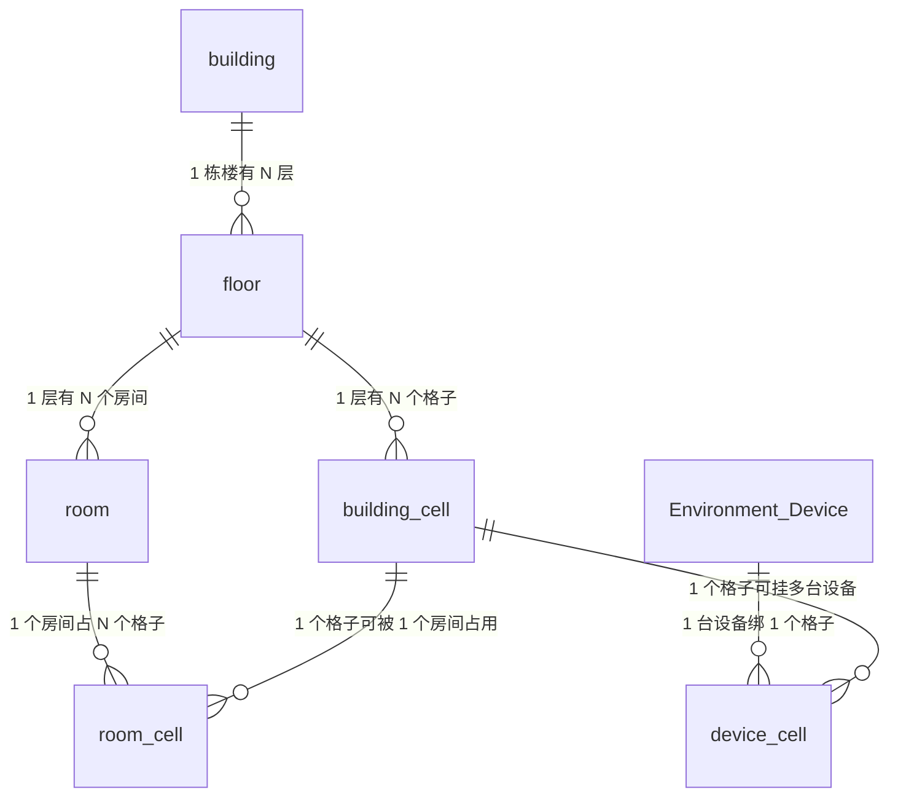

# WingOnIOT 系统说明（数据库 · API · 注意事项）

> 写给维护者看的大白话手册。看完这份文档，你应该能回答三个问题：
> 1. 数据都存在哪些表、表之间怎么串起来？
> 2. 前端调用哪些接口来读写数据？
> 3. 现在有哪些坑要特别注意？
>
> 文档基于修复后的当前代码（表名已统一小写、含软删与分区改造）。

---

# 一、数据库关联关系

## 1.1 一张图看懂（ER 关系图）



## 1.2 数据库里有几张表（都在 `WingOnIOT` 库）

| 表名 | 存的是什么（大白话） | 有没有"软删"字段 |
|---|---|---|
| `building` | **楼**，比如"WingOn 大樓" | ✅ 有 `is_deleted` |
| `floor` | **楼层**，比如 B2/F、G/F、4/F… | ✅ 有 `is_deleted` |
| `building_cell` | **格子**，3D 图里一块一块的小方块，带坐标/形状/颜色 | ✅ 有 `is_deleted` |
| `room` | **房间**，房间号 + 属于哪层 | ⚠️ 字段还在，但**删除走物理删**（不留伪删除） |
| `room_cell` | **"房间 ↔ 格子"的关系表**：这个房间占了哪些格子 | ✅ 有 `is_deleted`（用于"格子软删"联动；房间删除走外键级联） |
| `Environment_Device` | **环境监测设备**（温湿度传感器），sn 就是主键 | ❌ 没有（删设备只能硬删/解绑） |
| `device_cell` | **"设备 ↔ 格子"的关系表**：这个设备挂在哪个格子上 | ❌ 没有（一设备一格，绑定随时可重建，用物理删） |
| `Environmental_Monitoring` | **温湿度监测明细**：每台设备每小时一条温度/湿度记录 | ❌ 按**月份分区**的表，靠 DROP 分区清理 |
| `Environmental_Monitoring_Daily` | 降采样出的**日均值**表（趋势备用），由清理脚本自动建 | ❌ |
| `people_count_hourly` | **人流计数**：每个摄像头每小时人数 | ❌ |

> 另外还有一个 `milesight` 库（`tof` 雷达、`ug65/ug56` 网关数据），和楼宇没关系，是另一套设备数据。

## 1.3 "软删"是什么意思？怎么串联？

**软删** = 不真正删数据，只是打个"已删除"的标记（`is_deleted = 1`），后悔了还能恢复。

关系链是这么串的：

```
楼 → 层 → 格子 ──┐
                  ├─ 房间占了格子（room_cell）
                  └─ 设备挂在格子（device_cell）
```

**"大厅"是个看不见摸不着的东西**：一个格子是有效的（`is_deleted=0`），但没被任何**有效**房间占用，这个格子就叫"大厅"。挂在它上面的设备，就叫"大厅设备"。

```
有效格子 ──被有效房间占用──→ 房间里的格子
    │
    └──没被占用──────────→ 大厅格子（设备就是"大厅设备"）
```

### 各种删除行为对照表（大白话）

| 你做的事 | 实际发生什么 | 能恢复吗 |
|---|---|---|
| 删除一个房间（物理） | 房间直接删掉；它占的 `room_cell` 外键级联清空；格子上的设备自动变"大厅设备" | ❌ 不可恢复（房间可重建，重新分配格子即可） |
| 软删一个格子 | 格子打标记；`room_cell` 打标记、`device_cell` 被清掉 | ✅ 撤销（undo）可以连绑定一起恢复 |
| 硬删一个格子 | `room_cell`、`device_cell` 跟着一起物理删（外键自动清） | ❌ |
| 解绑设备 | 删除 `device_cell` 那条记录 | ❌（重新绑一下就行） |
| 房间/格子/楼层/楼栋软删超 90 天 | 每日清理脚本会**物理删除**，彻底没了 | ❌（过了 90 天就救不回） |

## 1.4 关键约束（数据库自动保证的规矩）

| 规矩 | 谁保证 | 大白话 |
|---|---|---|
| 一个格子只能属于一个房间 | `room_cell` 的**触发器** | 硬塞第二个房间，数据库直接报错拒绝 |
| 同一坐标只能有一个"活着"的格子 | `building_cell` 生成列唯一索引 | 就算绕过程序直插 SQL 也造不出两个同坐标格子 |
| 一台设备只能挂一个格子 | `device_cell` 的 `UNIQUE(sn)` | 重新绑定会自动换位置，不会留下两条 |
| 监测数据按月份分文件 | 分区表 | 查某月数据只翻那一个文件，删旧数据直接扔文件 |

---

# 二、程序相关 API

后端是 FastAPI，地址 `http://<主机>:8000`，所有业务接口前缀 `/api/v1`。前端页面就是通过这些接口读写的。

## 2.1 楼宇 / 楼层 / 格子 / 房间（building）

| 方法 | 路径 | 干什么（大白话） | 关键参数 |
|---|---|---|---|
| GET | `/api/v1/building/list` | 列出所有楼 | — |
| GET | `/api/v1/building/floors` | 列出所有层（带 3D 层号） | `building_id` 可选 |
| GET | `/api/v1/building/cell-shapes` | 3D 楼宇图用的格子形状/坐标/颜色 | `building_id` 可选 |
| GET | `/api/v1/building/floors/{floor_id}/cells` | 某层的所有格子 | — |
| GET | `/api/v1/building/floors/{floor_id}/rooms` | 某层的所有房间（带各自占的格子） | — |
| DELETE | `/api/v1/building/rooms/{room_id}` | **物理删除房间**（占用格子级联清空，设备自动变大厅；不可恢复） | 房间号 |
| POST | `/api/v1/building/rooms/{room_id}/cells` | **把一个格子分给这个房间**（已占用则先让出来；再点一次就是取消分配） | `floor_id`、`row_no`、`col_no` |
| PATCH | `/api/v1/building/cell-rotation` | 旋转单个格子 | `floor_id`/`row_no`/`col_no`/`rotation_xyz` |
| PATCH | `/api/v1/building/cell-rotation-all` | 整栋楼的格子统一旋转 | `building_id`/`rotation_xyz` |
| PATCH | `/api/v1/building/cell-rotation-row` | 一整列格子旋转 | `building_id`/`col_no`/`rotation_xyz` |
| POST | `/api/v1/building/cell-edit` | **新增/删除格子**（删除是软删，可撤销） | `action=add/delete`、`scope=single/row/col/...` |
| PATCH | `/api/v1/building/undo-edit` | 撤销上一次格子操作 | — |
| POST | `/api/v1/building/reset-grid-extras` | 把 8x12 之外多加的格子全部软删 | `building_id` |

## 2.2 环境设备 / 监测（environment）

| 方法 | 路径 | 干什么（大白话） | 关键参数 |
|---|---|---|---|
| GET | `/api/v1/environment/devices` | 所有环境设备列表，带最新温湿度、所在格子、所属房间（大厅设备 `room_id` 为 null） | — |
| POST | `/api/v1/environment/devices/{sn}/cell` | **把设备绑定到某个格子**（会自动换掉旧位置） | `floor_id`/`row_no`/`col_no` |
| DELETE | `/api/v1/environment/devices/{sn}/cell` | **解绑设备**（变回"没挂格子"） | — |
| GET | `/api/v1/environment/monitoring` | 温湿度监测明细分页 | `limit`/`offset` |
| GET | `/api/v1/environment/floor-summary` | 每层楼的温度/湿度汇总 | — |

## 2.3 人流计数（people-count）

| 方法 | 路径 | 干什么 | 关键参数 |
|---|---|---|---|
| GET | `/api/v1/people-count/hourly` | 每小时人流记录分页 | `date_from`/`date_to`/`hour`/`ip_address`/`channel_name`/`limit`/`offset` |
| GET | `/api/v1/people-count/channels` | 所有摄像头通道名（下拉框用） | — |

## 2.4 雷达 / 网关（tof / ug65，存 milesight 库）

| 方法 | 路径 | 干什么 |
|---|---|---|
| GET | `/api/v1/tof/devices` | 雷达设备列表 |
| GET | `/api/v1/tof` | 雷达明细（默认最近 48 小时） |
| GET | `/api/v1/tof/{row_id}` | 单条雷达记录 |
| GET | `/api/v1/ug65/devices` | 网关设备列表 |
| GET | `/api/v1/ug65` | 网关明细（默认最近 48 小时） |
| GET | `/api/v1/ug65/{row_id}` | 单条网关记录 |

## 2.5 系统（system）

| 方法 | 路径 | 干什么 |
|---|---|---|
| GET | `/health` | 探活（数据库通不通） |
| GET | `/api/v1/stats` | 库里有多少数据（tof/ug65 行数、设备数） |
| POST | `/api/v1/mqtt/test` | 测一下 MQTT 连不连得上 |

> 完整的接口说明可以启动后看 Swagger 文档：`http://<主机>:8000/docs`

---

# 三、现在的注意点（重要！）

## 3.1 已经修好的旧坑（一句话回顾）

- 软删格子会**联动清理**设备绑定/房间占用，撤销还能整组恢复 ✅
- 同坐标不允许有两个"活格子"，一格只允许一个房间 ✅
- 房间删除走**物理删除**（不留伪删除脏数据），设备归属自动回大厅 ✅
- 一设备一格，重复绑定自动换位置 ✅
- 监测表按月分区，旧数据可秒级清理 ✅
- 表名首字母大写：`Environment_Device`、`Environmental_Monitoring` ✅

## 3.2 还需要注意的坑

### 坑 1：房间布局的"改格子"前端还没接到数据库 ⚠️
前端页面里拖动格子分给房间，目前**只存在浏览器内存里**，刷新页面就没了，不会写回数据库。
后端的接口已经做好了（`POST /building/rooms/{room_id}/cells`），但前端还没接。**要持久化房间布局，需要前端改造**。

### 坑 2：数据库"清洁工"还没定时上班 ⚠️
`cleanup_wingon.py` 脚本（清僵尸绑定、扔超期假删、补下月分区、淘汰旧监测数据）写好了，但**没挂任何定时任务**，目前要靠人手动跑。
- 每天跑：`python cleanup_wingon.py`（保持干净）
- 每月跑：`python cleanup_wingon.py --drop-partitions --downsample`（真正清旧监测数据，会先留日均值）
不跑的话：旧监测数据一直占空间、新数据一直往兜底分区堆。

### 坑 3：撤销功能有"内存失忆" ⚠️
格子操作的撤销（undo）只能撤销最近 **10 步**，而且**服务重启就全部清空**。撤销是基于进程内存的，不是存数据库的。重要操作前想清楚。

### 坑 4：格子/楼层/楼栋的软删超过 90 天会被物理删除 ⚠️
格子/楼层/楼栋的"假删"数据超过 90 天没恢复，清理脚本会把它们**彻底删掉**。
**误删要在 90 天内恢复**，过期就救不回了。这是留恢复窗口，不是 bug。（房间不走软删，是直接物理删，见坑 9）

### 坑 5：设备绑定是"一设备一格"，换位就覆盖
一台设备只能挂一个格子。重新绑定 = 自动把旧位置顶掉（数据库层面保证只有一条）。
解绑用 `DELETE /environment/devices/{sn}/cell`。

### 坑 6：3D 楼宇图的数据别手改 ⚠️
`building_cell` 里的坐标、形状、颜色、`is_active` 是 3D 楼宇图（`/building-viewer`）的**显示基准**，当前展示是正确的。
- 想加/删格子：走 `POST /building/cell-edit`（可撤销），不要直接 UPDATE/INSERT 表。
- 想改旋转：走 `PATCH /building/cell-rotation*`。
- 直接 SQL 改数据可能会把 3D 图弄乱。

### 坑 7：一格一房，别硬塞
一个格子同时只能属于一个房间。后端接口会自动"先让出来再分配"，但你**直接往 `room_cell` 表插 SQL** 会被触发器拒绝（这是保护机制，报错是正常的）。

### 坑 8：写 SQL 时表名必须首字母大写
`Environment_Device`（不是 `environment_device`）、`Environmental_Monitoring`（不是 `environmental_monitoring`）。小写名字的表已经被重命名了，用旧名会报"表不存在"。

### 坑 9：删除房间 = 物理删除，不可恢复 ⚠️
删除房间后：占用格子自动清空、里面设备自动变"大厅设备"，而且**没有恢复功能**。
删之前想清楚；重建房间后设备不会自动回来，需要把格子重新分给房间，设备归属才会恢复。

---

# 四、日常常用命令（照抄就行）

```bash
# 启动后端 API（前端页面依赖它）
cd mqttapi
python api_server.py

# 每天跑一次：清僵尸绑定 + 扔超期假删 + 补下月分区
python cleanup_wingon.py

# 每月跑一次：把超过 4 个月的旧监测数据清掉（先留日均值再删）
python cleanup_wingon.py --drop-partitions --downsample

# 先看脚本会干什么（不真动手）
python cleanup_wingon.py --dry-run

# 跑一次数据库逻辑回归测试（44 项，全部 PASS 才算正常）
python test_wingon_fixes.py

# 全新环境初始化后执行迁移（表小写/软删/分区/触发器）
python migrate_wingon_fixes.py
```

---

# 附：数据流向一图流

```
MQTT 网关/雷达数据 ──► subscriber.py ──► milesight 库 (tof / ug65)
                                          │
温湿度设备数据 ──► Environmental_Monitoring（按月分区，可秒清）
                        │
                        ▼
                 daily 日均值表（清理时降采样留档）

用户操作（前端）──► /api/v1/* ──► WingOnIOT 库
    ├─ 楼/层/格子/房间   ──► building / floor / building_cell / room / room_cell
    ├─ 设备绑定/解绑     ──► Environment_Device / device_cell
    └─ 房间删除          ──► room（物理删，room_cell 外键级联清空）
```
