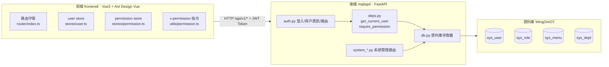
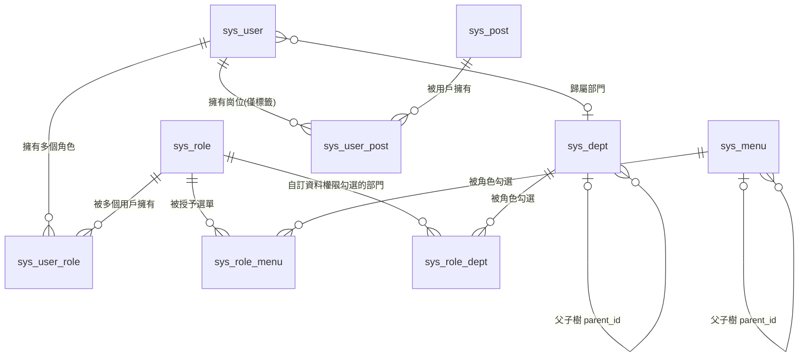
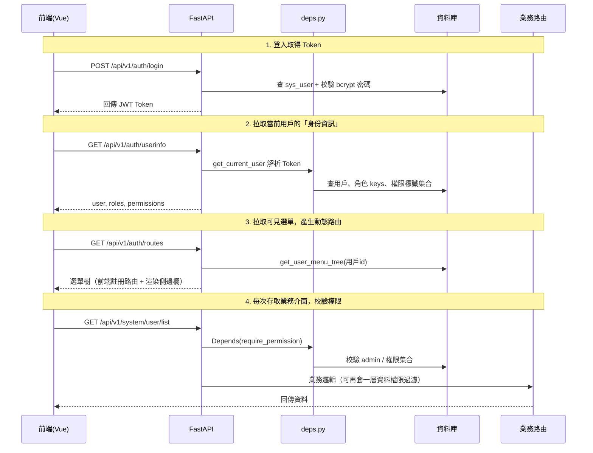
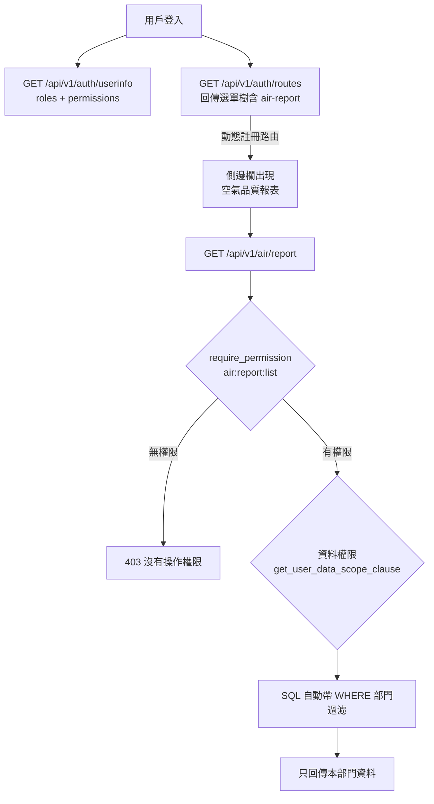

# WingOnIOT 權限系統 · 開發文件

> 🌐 **[English](#english-version)** | **繁體中文（當前）** | [← 返回專案根目錄](../../README_zh-HK.md)

---

> 寫給**初級開發者**看的技術文件。按照本專案的真實程式碼（FastAPI + Vue3 + MariaDB）講解：
> 1. 請求在後端是怎麼「走」的（登入 → 鑑權 → 校驗權限 → 回傳）；
> 2. 怎麼**新增一個帶權限的介面**（選單權限）；
> 3. 怎麼給介面加**資料權限**；
> 4. 用完整的 **Demo**（後端 + 前端）演示「新建介面 + 分配權限」的全過程。

---

## 目錄

- [第 1 章：系統架構與程式碼位置](#第-1-章系統架構與程式碼位置)
- [第 2 章：權限模型（資料表結構 + 關係圖）](#第-2-章權限模型資料表結構--關係圖)
- [第 3 章：認證與鑑權流程（後端走向）](#第-3-章認證與鑑權流程後端走向)
- [第 4 章：給介面加「選單權限」（require_permission）](#第-4-章給介面加選單權限require_permission)
- [第 5 章：給介面加「資料權限」（data_scope）](#第-5-章給介面加資料權限data_scope)
- [第 6 章：完整 Demo——新增「空氣品質報表」介面](#第-6-章完整-demo新增空氣品質報表介面)
- [第 7 章：前端權限控制（動態路由 / v-permission）](#第-7-章前端權限控制動態路由--v-permission)
- [第 8 章：常用指令與 SQL 備忘](#第-8-章常用指令與-sql-備忘)
- [English Version](#english-version)

---

## 第 1 章：系統架構與程式碼位置

### 1.1 整體架構



### 1.2 程式碼檔案位置

| 職責 | 檔案路徑 |
|---|---|
| 登入 / 用戶資訊 / 動態選單 | `../../mqttapi/app/api/routes/auth.py` |
| 鑑權依賴（取當前用戶、校驗權限） | `../../mqttapi/app/api/deps.py` |
| JWT / 密碼加密 | `../../mqttapi/app/security.py` |
| 資料庫存取層（權限相關全部方法） | `../../mqttapi/app/db.py` |
| 用戶管理路由 | `../../mqttapi/app/api/routes/system_user.py` |
| 角色管理路由（含資料權限） | `../../mqttapi/app/api/routes/system_role.py` |
| 選單管理路由 | `../../mqttapi/app/api/routes/system_menu.py` |
| 部門 / 崗位管理路由 | `../../mqttapi/app/api/routes/system_dept.py`、`system_post.py` |
| 操作日誌輔助 | `../../mqttapi/app/api/operlog.py` |
| 路由匯總註冊 | `../../mqttapi/app/api/router.py` |
| 權限表初始化 SQL | `../../mqttapi/sql/init_sys_permission.sql`、`init_sys_manage.sql` |
| 資料權限改造 SQL | `../../mqttapi/sql/init_role_data_scope.sql` |
| 前端 API 封裝（system） | `../../frontend/src/api/system.ts` |
| 前端 API 封裝（auth） | `../../frontend/src/api/auth.ts` |
| 前端路由守衛 | `../../frontend/src/router/index.ts` |
| 前端用戶 store | `../../frontend/src/stores/user.ts` |
| 前端動態路由 store | `../../frontend/src/stores/permission.ts` |
| 前端按鈕權限指令 | `../../frontend/src/utils/permission.ts` |

---

## 第 2 章：權限模型（資料表結構 + 關係圖）

本系統**完整複製了若依（RuoYi）的 RBAC 權限模型**：選單即權限。

### 2.1 ER 關係圖



### 2.2 各表作用速查

| 資料表 | 作用 | 關鍵欄位 | 說明 |
|---|---|---|---|
| `sys_user` | 用戶（登入帳號） | `id`、`username`、`password`(bcrypt)、`dept_id`、`status` | 密碼**只存雜湊**，不可反查 |
| `sys_role` | 角色（權限集合） | `id`、`role_name`、`role_key`、`status`、`data_scope` | `role_key='admin'` 為內建超管 |
| `sys_menu` | 選單/按鈕（權限清單） | `id`、`parent_id`、`menu_type`(M/C/F)、`permission`、`path`、`component` | **F 按鈕的 `permission` 就是權限標識** |
| `sys_dept` | 部門（樹） | `dept_id`、`parent_id`、`ancestors`、`del_flag` | 資料權限按部門維度計算 |
| `sys_post` | 崗位（僅標籤，**不控權限**） | `post_id`、`post_code`、`post_name` | 只做身份標識 |
| `sys_user_role` | 用戶-角色 關聯 | `user_id`、`role_id` | 多對多 |
| `sys_role_menu` | 角色-選單 關聯 | `role_id`、`menu_id` | 多對多 |
| `sys_user_post` | 用戶-崗位 關聯 | `user_id`、`post_id` | 多對多 |
| `sys_role_dept` | 角色-部門 關聯（**資料權限**） | `role_id`、`dept_id` | 僅 `data_scope=2` 自訂時使用 |
| `sys_oper_log` | 操作日誌 | `title`、`oper_name`、`business_type`、`status` | 寫介面時透過 `record_operlog` 記錄 |
| `sys_login_log` | 登入日誌 | `user_name`、`ipaddr`、`status` | 登入時自動記錄 |
| `sys_whitelist` | 免登入白名單 | `path`、`path_type`(F前端路由 / A後端API) | `A` 類型的 GET 請求免登入 |

### 2.3 資料權限欄位

`sys_role.data_scope` 取值含義（第 5 章會講實作）：

| 值 | 含義 | 常數對應（見 `test_data_scope.py`） |
|---|---|---|
| `1` | 全部資料權限 | `SCOPE_ALL` |
| `2` | 自訂資料權限（配合 `sys_role_dept`） | `SCOPE_CUSTOM` |
| `3` | 本部門資料權限 | `SCOPE_DEPT` |
| `4` | 本部門及以下資料權限 | `SCOPE_DEPT_AND_CHILD` |
| `5` | 僅本人資料權限 | `SCOPE_SELF` |

---

## 第 3 章：認證與鑑權流程（後端走向）

### 3.1 請求「走」一遍（時序圖）



### 3.2 三個核心函數（後端入口）

**1. `get_current_user`** — `../../mqttapi/app/api/deps.py`

作用：從請求頭 `Authorization: Bearer <token>` 解析出當前登入用戶；未登入 / token 過期 / 帳號停用都會拋 401/403。

```python
def get_current_user(request, credentials=Depends(bearer_scheme), ...):
    # GET 請求命中後端 API 白名單（sys_whitelist.path_type='A'）時，
    # 放行匿名用戶（大螢幕只讀介面），但 POST/PUT/PATCH/DELETE 仍要求登入。
    if request.method == "GET" and db.is_api_whitelisted(request.url.path):
        return {"id": 0, "username": "anonymous", "nickname": "anonymous", "status": 1}
    if credentials is None:
        raise AuthError("未登入或登入憑證缺失")
    payload = decode_access_token(settings, credentials.credentials)
    user = db.get_sys_user_by_id(int(payload["sub"]))
    if user is None:
        raise AuthError("用戶不存在")
    if user.get("status") != 1:
        raise AuthError("帳號已停用，請聯繫管理員", code=403)
    return user
```

**2. `require_permission(permission)`** — 權限校驗的「工廠」

作用：**給介面加權限，核心就是這一行**。它回傳一個依賴，FastAPI 會先執行它，校驗失敗直接 403。

```python
def require_permission(permission: str):
    def checker(user=Depends(get_current_user), db=Depends(get_db)):
        if db.is_super_admin(user["id"]):          # admin 超管直接放行
            return user
        perms = db.get_user_permissions(user["id"]) # 合併所有角色的權限標識
        if "*:*:*" in perms or permission in perms:  # 全權限 或 含指定標識
            return user
        raise AuthError(f"沒有操作權限（{permission}）", code=403)
    return checker
```

**3. `get_user_permissions(user_id)`** — `../../mqttapi/app/db.py`

作用：把該用戶所有角色的 `sys_menu.permission`（F 按鈕標識）合併成一個集合；超管直接回傳 `["*:*:*"]`。

```python
def get_user_permissions(self, user_id):
    if self.is_super_admin(user_id):
        return ["*:*:*"]
    # SELECT DISTINCT m.permission
    # FROM sys_menu m
    # JOIN sys_role_menu rm  ON rm.menu_id  = m.id
    # JOIN sys_user_role ur  ON ur.role_id = rm.role_id
    # JOIN sys_role r        ON r.id       = ur.role_id
    # WHERE ur.user_id = ? AND r.status = 1 AND m.status = 1
    #   AND m.permission IS NOT NULL AND m.permission <> ''
```

### 3.3 三種「放行」方式的區別（重點）

| 方式 | 程式碼位置 | 誰能過 | 典型場景 |
|---|---|---|---|
| 不寫權限依賴（僅 `get_current_user`） | 路由參數 | 任何**已登入**用戶 | 查看自己的資訊、大螢幕資料 |
| `Depends(require_permission("xxx:yyy:zzz"))` | 路由參數 | 擁有該**權限標識**的用戶 | 系統管理的增刪改查 |
| 白名單（`sys_whitelist` 的 `A` 類型） | 資料庫設定 | **未登入也能 GET** | 大螢幕只讀介面（`/api/v1/building` 等） |

---

## 第 4 章：給介面加「選單權限」（require_permission）

### 4.1 三步走（後端）

1. **建路由檔案 / 寫介面**，在參數裡加 `Depends(require_permission("system:xxx:list"))`；
2. **在 `sys_menu` 表插入一條選單記錄**（C 選單 + F 按鈕，`permission` 填權限標識）；
3. **用 admin 登入網頁，在「角色管理 → 編輯」勾選新選單**，授予對應角色。

### 4.2 看真實例子：用戶管理列表

`mqttapi/app/api/routes/system_user.py:41`

```python
@router.get("/list")
def list_users(
    keyword: str | None = Query(None),
    ...
    db: Database = Depends(get_db),
    user: dict = Depends(require_permission("system:user:list")),  # <-- 權限校驗
) -> dict[str, Any]:
    rows, total = db.list_sys_users(
        keyword=keyword, status=status, dept_id=dept_id,
        scope_user_id=user["id"], offset=offset, limit=limit,   # <-- 資料權限過濾
    )
    return {"total": total, "limit": limit, "offset": offset, "items": rows}
```

對應的選單記錄（見 `../../mqttapi/sql/init_sys_permission.sql`）：

```sql
-- C 選單：頁面本身
(23, 22, '用戶管理', 'system.user', 'system/user', 'system/UserManage', 'C', 'system:user:list', ...);
-- F 按鈕：頁面裡的操作
(24, 23, '用戶新增', '', '', '', 'F', 'system:user:add', ...);
(25, 23, '用戶修改', '', '', '', 'F', 'system:user:edit', ...);
(26, 23, '用戶刪除', '', '', '', 'F', 'system:user:remove', ...);
```

> 權限標識的命名約定：`模組:功能:動作`，如 `system:user:list` / `system:role:assignMenu`。

---

## 第 5 章：給介面加「資料權限」（data_scope）

### 5.1 原理

資料權限 = 在查詢時**自動追加一段 WHERE 過濾**，把資料限制在用戶角色的資料範圍內。

核心方法：`db.get_user_data_scope_clause(user_id, alias, dept_col, user_col)`（`mqttapi/app/db.py:2196`）

```python
def get_user_data_scope_clause(self, user_id, *, alias="u", dept_col="dept_id", user_col="id"):
    # 超管：不過濾
    if self.is_super_admin(user_id):
        return "", {}
    scopes = self.get_user_role_data_scopes(user_id)   # 用戶所有角色的 data_scope
    if not scopes:
        return "", {}
    # 任一角色是「1 全部」：不過濾
    if any(s["data_scope"] == "1" for s in scopes):
        return "", {}
    user_dept_id = ...  # 當前用戶所屬部門
    or_parts, params = [], {}
    for i, s in enumerate(scopes):
        if scope == "2":   # 自訂 -> dept_id IN (sys_role_dept 裡勾選的部門)
            ...
        elif scope == "3": # 本部門 -> dept_id = 當前用戶部門
            ...
        elif scope == "4": # 本部門及以下 -> 部門 = 本人 或 在 ancestors 裡
            ...
        elif scope == "5": # 僅本人 -> id = 當前用戶
            ...
    return "(" + " OR ".join(or_parts) + ")", params   # 多角色取聯集
```

### 5.2 如何使用（以用戶列表為例）

`mqttapi/app/db.py:1893` 的 `list_sys_users`：

```python
if scope_user_id is not None:
    scope_sql, scope_params = self.get_user_data_scope_clause(
        scope_user_id, alias="u", dept_col="dept_id", user_col="id"
    )
    if scope_sql:
        where.append(scope_sql)          # 追加到 WHERE
        params.update(scope_params)
```

### 5.3 給自己介面加資料權限的三個步驟

1. **介面收到當前用戶 id**（透過 `require_permission` 或 `get_current_user` 的回傳值 `user["id"]`）；
2. 在 db 方法裡呼叫 `get_user_data_scope_clause(user_id, alias="表別名", dept_col="部門欄", user_col="主鍵欄")`；
3. 把回傳的 `(sql片段, 參數)` 拼進查詢的 WHERE 條件。

> 注意：拼接時必須用**參數佔位**（`%(xxx)s`），不要把用戶輸入拼進 SQL，防注入。
> 資料權限是**「按部門維度」**過濾的，所以你的業務表需要有一列能對應部門（`dept_id`）或歸屬用戶（`user_id`），否則用不了這套機制。

---

## 第 6 章：完整 Demo——新增「空氣品質報表」介面

> 下面我們模擬一個業務：**給系統新增一個「空氣品質報表」頁面**，只有被授權的人能看，而且**資料權限**只讓用戶看到自己部門的資料。

### 6.1 需求描述

- 後端新增介面：`GET /api/v1/air/report`，回傳本部門空氣品質資料；
- 權限標識：頁面 `air:report:list`，按鈕 `air:report:export`（匯出）；
- 資料權限：非超管用戶只能看到自己部門的資料。

### 6.2 後端部分

**1. 新建路由檔案** `mqttapi/app/api/routes/air_report.py`：

```python
"""空氣品質報表：演示「選單權限 + 資料權限」的完整寫法。"""
from __future__ import annotations

from typing import Any

from fastapi import APIRouter, Depends, Query, Request
from pydantic import BaseModel, Field

from app.api.deps import get_current_user, get_db, require_permission
from app.api.operlog import BT_INSERT, record_operlog
from app.db import Database

router = APIRouter(prefix="/api/v1/air", tags=["air-report"])


class AirReportBody(BaseModel):
    dept_id: int
    pm25: float = Field(..., description="PM2.5 濃度")
    pm10: float = Field(..., description="PM10 濃度")


@router.get("/report")
def list_report(
    offset: int = Query(0, ge=0),
    limit: int = Query(20, ge=1, le=100),
    db: Database = Depends(get_db),
    user: dict = Depends(require_permission("air:report:list")),  # <-- 選單權限
) -> dict[str, Any]:
    """空氣品質報表列表：按當前用戶的資料權限過濾部門。"""
    rows, total = db.list_air_reports(
        scope_user_id=user["id"],     # <-- 資料權限
        offset=offset, limit=limit,
    )
    return {"total": total, "limit": limit, "offset": offset, "items": rows}


@router.post("/report")
def create_report(
    body: AirReportBody,
    request: Request,
    db: Database = Depends(get_db),
    user: dict = Depends(get_current_user),
    _p: dict = Depends(require_permission("air:report:add")),  # <-- 按鈕權限
) -> dict[str, Any]:
    report_id = db.create_air_report(body.model_dump())
    record_operlog(   # <-- 記錄操作日誌
        db, request, user, title="空氣品質報表", business_type=BT_INSERT,
        param=body.model_dump(), result={"id": report_id},
    )
    return {"id": report_id}
```

**2. 在 `db.py` 加兩個方法**（資料存取層）：

```python
# 1) 查詢：套用資料權限
def list_air_reports(self, *, scope_user_id=None, offset=0, limit=20):
    where, params = ["1=1"], {}
    if scope_user_id is not None:
        scope_sql, scope_params = self.get_user_data_scope_clause(
            scope_user_id, alias="a", dept_col="dept_id", user_col="id"
        )
        if scope_sql:
            where.append(scope_sql)
            params.update(scope_params)
    clause = " AND ".join(where)
    params["limit"], params["offset"] = limit, offset
    with self.wingon_connection() as conn:
        with conn.cursor() as cur:
            cur.execute(f"SELECT COUNT(*) AS cnt FROM air_report a WHERE {clause}",
                        {k: v for k, v in params.items() if k not in ("limit", "offset")})
            total = int((cur.fetchone() or {}).get("cnt") or 0)
            cur.execute(
                f"SELECT a.id, a.dept_id, d.dept_name, a.pm25, a.pm10, a.created_at "
                f"FROM air_report a LEFT JOIN sys_dept d ON d.dept_id = a.dept_id "
                f"WHERE {clause} ORDER BY a.id DESC LIMIT %(limit)s OFFSET %(offset)s",
                params,
            )
            rows = cur.fetchall() or []
    return [dict(r) for r in rows], total

# 2) 新增
def create_air_report(self, data):
    with self.wingon_connection() as conn:
        with conn.cursor() as cur:
            cur.execute(
                "INSERT INTO air_report (dept_id, pm25, pm10) "
                "VALUES (%(dept_id)s, %(pm25)s, %(pm10)s)",
                data,
            )
            return int(cur.lastrowid)
```

> 假設你已經建好業務表 `air_report`（含 `dept_id` 欄位），例如：
> ```sql
> CREATE TABLE air_report (
>   id BIGINT AUTO_INCREMENT PRIMARY KEY,
>   dept_id BIGINT NOT NULL COMMENT '歸屬部門（資料權限靠它過濾）',
>   pm25 FLOAT, pm10 FLOAT,
>   created_at DATETIME NOT NULL DEFAULT CURRENT_TIMESTAMP
> );
> ```

**3. 在 `../../mqttapi/app/api/router.py` 註冊路由**：

```python
from app.api.routes import (
    ...
    air_report,   # 新增
)
...
api_router.include_router(air_report.router)   # 新增
```

**4. 插入選單記錄**（權限清單），執行 SQL：

```sql
-- 假設「大樓監控」目錄 id=2；新建一個 C 選單 + 2 個 F 按鈕
INSERT INTO sys_menu (id, parent_id, menu_name, i18n_key, path, component,
                      menu_type, permission, icon, sort, visible, status) VALUES
(200, 2, '空氣品質報表', 'menu.airReport', 'air-report', 'AirReportView',
 'C', 'air:report:list', 'BarChartOutlined', 7, 1, 1),
(201, 200, '報表新增', '', '', '', 'F', 'air:report:add', '', 1, 1, 1),
(202, 200, '報表匯出', '', '', '', 'F', 'air:report:export', '', 2, 1, 1);

-- 給超級管理員（role_id=1）授予全部權限
INSERT INTO sys_role_menu (role_id, menu_id)
SELECT 1, id FROM sys_menu WHERE id IN (200, 201, 202);
```

### 6.3 前端部分

**1. 在 `../../frontend/src/api/system.ts` 加介面方法**：

```ts
// ---------- 空氣品質報表（Demo） ----------
export interface AirReportRow {
  id: number
  dept_id?: number
  dept_name?: string
  pm25?: number
  pm10?: number
  created_at?: string
}

export function listAirReports(params: { offset?: number; limit?: number }) {
  return api.get<PageResult<AirReportRow>>('/api/v1/air/report', { params })
}

export function createAirReport(body: { dept_id: number; pm25: number; pm10: number }) {
  return api.post<{ id: number }>('/api/v1/air/report', body)
}
```

**2. 新建頁面** `frontend/src/views/AirReportView.vue`（關鍵部分）：

```vue
<script setup lang="ts">
import { onMounted, ref } from 'vue'
import { listAirReports } from '@/api/system'
import type { AirReportRow } from '@/api/system'

const rows = ref<AirReportRow[]>([])
async function load() {
  const res = await listAirReports({ limit: 100 })
  rows.value = res.data.items
}
onMounted(load)
</script>

<template>
  <div class="app-container">
    <a-card :bordered="false">
      <!-- 匯出按鈕：只有擁有 air:report:export 權限的用戶才顯示 -->
      <a-button v-permission="'air:report:export'" type="primary">匯出</a-button>
      <a-table :data-source="rows" row-key="id">
        <a-table-column title="部門" data-index="dept_name" />
        <a-table-column title="PM2.5" data-index="pm25" />
        <a-table-column title="PM10" data-index="pm10" />
      </a-table>
    </a-card>
  </div>
</template>
```

> 頁面檔案放對路徑即可：**動態路由會自動按 `sys_menu.component` 欄位懶載入**。
> 因為 `permission store` 用 `import.meta.glob('@/views/**/*.vue')` 預收集了所有頁面，
> 所以新建 `AirReportView.vue` 後無需改路由檔案。

### 6.4 分配權限（網頁操作）

1. 用 **admin** 登入系統；
2. 選單「系統管理 → 選單管理」：確認「空氣品質報表」及兩個按鈕已出現；
3. 選單「系統管理 → 角色管理 → 編輯某個角色」：勾上「空氣品質報表」及其按鈕；
4. （可選）選單「角色管理 → 資料權限」：把該角色的資料範圍設為「本部門」或「自訂」；
5. 讓對應用戶**重新登入**，即可在側邊欄看到新頁面。

### 6.5 Demo 的請求走向圖



---

## 第 7 章：前端權限控制（動態路由 / v-permission）

### 7.1 三層控制

| 層級 | 實作 | 效果 |
|---|---|---|
| 選單/路由層 | `router/index.ts` 守衛 + `stores/permission.ts` 動態註冊 | 沒權限的頁面**側邊欄不顯示**，直接輸 URL 也進不去 |
| 頁面內按鈕層 | `v-permission="'system:user:add'"` 指令（`utils/permission.ts`） | 沒權限的按鈕**直接從 DOM 移除** |
| 介面層 | 後端 `require_permission` | 就算繞開前端，介面也會 403 |

### 7.2 登入後的前端流程（`router/index.ts` 守衛）

```ts
router.beforeEach(async (to) => {
  const userStore = useUserStore()
  const permissionStore = usePermissionStore()

  if (to.path === '/login') {
    if (userStore.token) return { path: '/' }
    return true
  }
  // 未登入：命中白名單（大螢幕）放行，否則跳登入
  if (!userStore.token) {
    await ensureWhitelist()
    if (isWhitelistedPath(to.path)) return true
    return { path: '/login', query: { redirect: to.fullPath } }
  }
  // 已登入但動態路由沒載入：拉用戶資訊 + 選單
  if (!permissionStore.routesLoaded) {
    try {
      await userStore.fetchUserInfo()       // userinfo -> roles/permissions
      await permissionStore.generateRoutes() // routes -> addRoute 動態註冊
      return { path: to.fullPath, replace: true }
    } catch {
      userStore.reset(); permissionStore.reset()
      return { path: '/login' }
    }
  }
  return true
})
```

### 7.3 按鈕權限指令 `v-permission`

```ts
// utils/permission.ts：無權限時直接從父節點移除元素
function checkPermission(el, value) {
  if (!value) return
  const perms = Array.isArray(value) ? value : [value]
  const userStore = useUserStore()
  if (perms.some((p) => userStore.hasPermission(p))) return
  el.parentNode?.removeChild(el)
}
```

用法（頁面裡）：

```vue
<a-button v-permission="'system:user:add'" type="primary">新增</a-button>
<a-button v-permission="['system:user:edit', 'system:user:add']">編輯或新增任一權限即顯示</a-button>
```

`hasPermission` 邏輯（`stores/user.ts`）：空值放行 → admin 角色放行 → `*:*:*` 放行 → 權限集合包含該標識。

---

## 第 8 章：常用指令與 SQL 備忘

### 8.1 執行與測試

```bash
# 啟動後端（前端依賴它）
cd mqttapi && python api_server.py

# Swagger 線上除錯：http://127.0.0.1:8000/docs

# 權限鏈路端到端測試
cd mqttapi
python test_permission_chain.py   # 建用戶/角色/綁定 -> 登入 -> 驗證可見選單與權限
python test_role_api.py           # 角色介面測試
python test_data_scope.py         # 資料權限（5 種範圍 + 多角色合併）測試
python test_iot_auth.py           # 認證保護（未登入 401 / 白名單 / 寫操作攔截）
```

### 8.2 初始化 / 遷移 SQL

```bash
# 權限核心表 + admin 初始帳號
mysql -uroot -proot WingOnIOT < mqttapi/sql/init_sys_permission.sql
# 部門/崗位/登入日誌/參數/字典/白名單 + 選單擴展
mysql -uroot -proot WingOnIOT < mqttapi/sql/init_sys_manage.sql
# 資料權限（sys_role.data_scope + sys_role_dept）
mysql -uroot -proot WingOnIOT < mqttapi/sql/init_role_data_scope.sql
```

### 8.3 常用查詢

```sql
-- 查某用戶的所有權限標識
SELECT DISTINCT m.permission
FROM sys_menu m
JOIN sys_role_menu rm ON rm.menu_id = m.id
JOIN sys_user_role ur ON ur.role_id = rm.role_id
JOIN sys_role r ON r.id = ur.role_id
WHERE ur.user_id = 1 AND r.status = 1 AND m.status = 1
  AND m.permission IS NOT NULL AND m.permission <> '';

-- 查某角色的資料範圍與勾選的部門
SELECT r.data_scope, rd.dept_id
FROM sys_role r
LEFT JOIN sys_role_dept rd ON rd.role_id = r.id
WHERE r.id = 2;

-- 重置 admin 密碼（bcrypt 雜湊，rounds=10，範例雜湊對應 admin123）
UPDATE sys_user SET password = '$2b$10$cG0BT3ORFQUTyMkeYVNrnOALZ7oompp1nGLRKbCIfbjDzB7WxmnEG' WHERE username = 'admin';
```

### 8.4 易踩的坑（重點！）

| 坑 | 說明 |
|---|---|
| **權限標識對不上** | 後端 `require_permission("system:user:list")` 裡的字串，必須與 `sys_menu.permission` 完全一致；按鈕上的 `v-permission` 也要一致，否則前後端「各管各的」 |
| **F 按鈕的權限靠 C 選單授權** | 角色勾選 C 選單時，最好把它的 F 子按鈕一起勾上，否則頁面能進、按鈕不顯示 |
| **資料權限需要部門欄** | 業務表需要有一列能對應 `dept_id`（或用戶 `id`），才能套用 `get_user_data_scope_clause` |
| **多角色權限取聯集** | 用戶有多個角色時權限合併；任一角色為「全部資料權限」則能看到全部資料 |
| **崗位不控權限** | 新手常誤把權限掛在崗位（sys_post）上——本系統崗位僅是標籤 |
| **白名單 A 類型只放行 GET** | `sys_whitelist.path_type='A'` 僅對 GET 免登入；寫操作（POST/PUT/DELETE）仍要求登入 |
| **不要手改 admin 之外的權限繞過校驗** | 前端隱藏按鈕 != 後端安全，介面權限以 `require_permission` 為準 |
| **操作日誌盡量記錄** | 寫操作（增刪改、授權）記得呼叫 `record_operlog`，方便審計追溯 |
| **密碼不能反查** | 密碼是 bcrypt 雜湊，只能重置，不能「查看明文」 |

---

## English Version

> 🌐 **English** | [繁體中文（上方完整內容）](#wingoniot-權限系統--開發文件)

### Architecture Overview

```
Frontend (Vue3)  ──HTTP + JWT──▶  Backend (FastAPI)  ──SQL──▶  MariaDB (WingOnIOT)
     │                                    │
     ├─ router/index.ts (守衛)            ├─ deps.py (get_current_user / require_permission)
     ├─ stores/permission.ts (動態路由)    ├─ db.py (資料庫存取層)
     └─ utils/permission.ts (v-permission)└─ system_*.py (業務路由)
```

### RBAC Permission Model

| Table | Purpose |
|---|---|
| `sys_user` | Login account (bcrypt password, belongs to a department) |
| `sys_role` | Permission bundle (`role_key`, `data_scope`) |
| `sys_menu` | Page (C) + Button (F) records; F-type `permission` = permission identifier |
| `sys_dept` | Department tree (`ancestors` for hierarchy) |
| `sys_post` | Job title label only — does NOT control permissions |
| `sys_user_role` | User ↔ Role (many-to-many) |
| `sys_role_menu` | Role ↔ Menu (many-to-many) |
| `sys_role_dept` | Role ↔ Department (data permission, custom scope only) |

### How to Add a New Protected Endpoint

**Step 1 — Backend**: Add `Depends(require_permission("module:func:action"))` to the route.

```python
@router.get("/report")
def list_report(
    db: Database = Depends(get_db),
    user: dict = Depends(require_permission("air:report:list")),
) -> dict[str, Any]:
    rows, total = db.list_air_reports(scope_user_id=user["id"], ...)
    return {"total": total, "items": rows}
```

**Step 2 — Database**: Insert C-menu + F-button records into `sys_menu` with matching `permission` values.

```sql
INSERT INTO sys_menu (id, parent_id, menu_name, path, component, menu_type, permission, ...)
VALUES
(200, 2, 'Air Quality Report', 'air-report', 'AirReportView', 'C', 'air:report:list', ...),
(201, 200, 'Add', '', '', 'F', 'air:report:add', ...),
(202, 200, 'Export', '', '', 'F', 'air:report:export', ...);
```

**Step 3 — Assign**: Log in as admin → Role Management → Edit → Check the new menu → Save.

**Step 4 — Data Permission** (optional): Call `get_user_data_scope_clause()` in your db method to auto-filter by department.

```python
scope_sql, scope_params = self.get_user_data_scope_clause(
    user_id, alias="a", dept_col="dept_id", user_col="id"
)
if scope_sql:
    where.append(scope_sql)
    params.update(scope_params)
```

**Step 5 — Frontend**: Create the page file at `frontend/src/views/AirReportView.vue`. The dynamic router will auto-load it based on `sys_menu.component`. Use `v-permission` for button visibility.

```vue
<a-button v-permission="'air:report:export'" type="primary">Export</a-button>
```

### Data Permission Scopes

| Value | Scope | SQL Filter |
|---|---|---|
| `1` | All data | No filter |
| `2` | Custom departments | `dept_id IN (SELECT dept_id FROM sys_role_dept WHERE role_id = ?)` |
| `3` | Own department | `dept_id = user's dept_id` |
| `4` | Own dept + children | `dept_id = user's OR FIND_IN_SET(user's, ancestors)` |
| `5` | Self only | `id = user_id` |

Multi-role: **OR merge**. If any role has scope `1`, no filter applied. Super admin always sees all.

### Key Gotchas

- Permission identifiers must match **exactly** between backend (`require_permission`), database (`sys_menu.permission`), and frontend (`v-permission`).
- The `sys_post` table is **label-only** — it does NOT control access.
- Whitelist type `A` only bypasses auth for GET requests; POST/PUT/DELETE still require login.
- Never expose or log plaintext passwords. bcrypt hashes are one-way.
- Use `record_operlog()` for write operations to maintain an audit trail.

---

> 完整介面列表可在後端啟動後查看 Swagger：`http://<主機>:8000/docs`