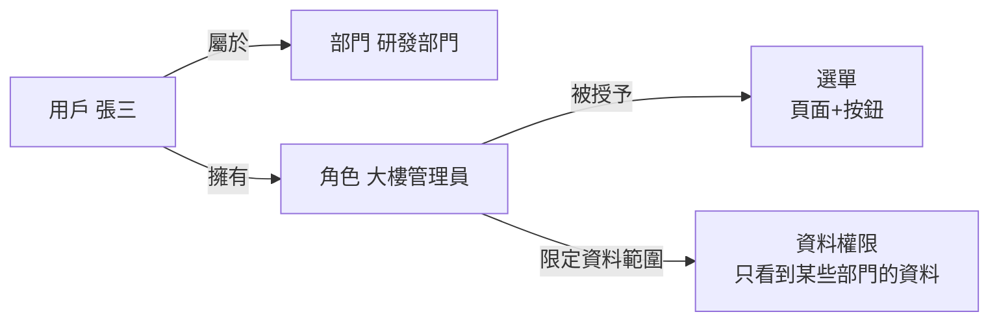

# WingOnIOT 權限系統 · 用戶手冊

> 🌐 **[English](#english-version)** | **繁體中文（當前）** | [← 返回專案根目錄](../../README_zh-HK.md)

---

> 這是一份寫給**完全沒有經驗、第一次使用本系統**的用戶看的操作手冊。
> 你不需要懂任何程式設計，跟著這份文件一步一步點，就能學會：
> 1. 怎麼新建一個帳號（用戶）；
> 2. 怎麼給帳號分配權限（能看什麼、能做什麼）；
> 3.「資料權限」到底是幹嘛的，怎麼設定；
> 4. 用戶 / 角色 / 選單 / 部門 / 崗位 這五個詞分別是什麼意思。

---

## 目錄

- [第 1 章：一分鐘認識系統](#第-1-章一分鐘認識系統)
- [第 2 章：登入系統](#第-2-章登入系統)
- [第 3 章：五個名詞一次搞懂（用戶/角色/選單/部門/崗位）](#第-3-章五個名詞一次搞懂用戶角色選單部門崗位)
- [第 4 章：資料權限（Data Permission）詳解](#第-4-章資料權限data-permission詳解)
- [第 5 章：實作流程——從零建一個「有權限」的新用戶](#第-5-章實作流程從零建一個有權限的新用戶)
- [第 6 章：日常維護（改權限 / 停用 / 刪除 / 重置密碼）](#第-6-章日常維護改權限--停用--刪除--重置密碼)
- [第 7 章：常見問題 FAQ](#第-7-章常見問題-faq)
- [English Version](#english-version)

---

## 第 1 章：一分鐘認識系統

**WingOnIOT 控制台**是一個網頁系統，用來查看和管理大樓裡的各種設備資料（溫濕度感測器、人流攝影機、雷達、閘道器等）。

和權限相關的所有操作，都集中在左側選單的 **「系統管理」** 下面：

```
┌────────────────────────────────────────────────────────────┐
│  側邊欄（左邊這一列）                                        │
│  ┌──────────────────────┐   ┌───────────────────────────┐  │
│  │ 儀表板                │   │  這裡是右邊的「正文區域」     │  │
│  │ 大樓監控              │   │                           │  │
│  │   ├ 棟棟可視化        │   │  你在左邊點哪個選單，        │  │
│  │   ├ 設備管理          │   │  右邊就顯示對應的內容。      │  │
│  │   └ 人流統計          │   │                           │  │
│  │ 系統管理  ◀── 點這裡    │   │                           │  │
│  │   ├ 用戶管理          │   │                           │  │
│  │   ├ 角色管理          │   │                           │  │
│  │   ├ 選單管理          │   │                           │  │
│  │   ├ 部門管理          │   │                           │  │
│  │   ├ 崗位管理          │   │                           │  │
│  │   ├ 字典管理          │   │                           │  │
│  │   ├ 參數設定          │   │                           │  │
│  │   ├ 白名單設定        │   │                           │  │
│  │   └ 日誌管理          │   │                           │  │
│  │      ├ 登入日誌       │   │                           │  │
│  │      └ 操作日誌       │   │                           │  │
│  └──────────────────────┘   └───────────────────────────┘  │
└────────────────────────────────────────────────────────────┘
```

> 💡 **能不能看到這些選單，取決於你登入的帳號被授予了什麼權限。**
> 如果登入後看不到「系統管理」，說明當前帳號沒有管理權限，需要找管理員給你授權。

**權限是怎麼工作的？一句話版本：**

> 管理員把「某個人」（用戶）放進「某個身份」（角色）裡，而這個「身份」事先已經規定了「能看哪些頁面、能點哪些按鈕、能看到哪些部門的資料」。用戶登入後，系統就自動按這個身份來放行。

下面先花兩分鐘認識這五個名詞，再動手操作。

---

## 第 2 章：登入系統

1. 開啟瀏覽器（推薦 **Chrome / Edge**），在網址列輸入系統的網址，例如：
   `http://192.168.1.100/`（以管理員給你的實際網址為準）
2. 看到登入頁面後，輸入 **帳號** 和 **密碼**：

```
┌─────────────────────────────────────┐
│           WingOnIOT 控制台           │
│                                     │
│   帳號  [____________________]      │
│   密碼  [____________________]      │
│                                     │
│        [     登 入     ]            │
└─────────────────────────────────────┘
```

3. 點擊「登入」。

> ⚠️ **注意**：系統會自動記錄登入日誌（誰、什麼時間、從哪個 IP、用什麼瀏覽器登入的）。連續輸錯密碼也會被記錄。如果提示「帳號已停用」，說明帳號被管理員停用了，請聯繫管理員。

---

## 第 3 章：五個名詞一次搞懂（用戶/角色/選單/部門/崗位）

用一座**辦公大樓**來打比方，你馬上就能懂：

| 名詞 | 相當於辦公大樓裡的 | 白話解釋 | 在本系統裡負責什麼 |
|---|---|---|---|
| **用戶（User）** | 一個**員工** | 一個能登入系統的帳號，例如 `張三`、`李四` | 記錄帳號、密碼、姓名、聯絡方式、屬於哪個部門 |
| **角色（Role）** | 一個**崗位職責說明書** | 「他是什麼身份，能幹什麼」，例如「人事專員」、「大樓管理員」 | **真正管權限的**：決定能看哪些選單、能點哪些按鈕、能看到哪些部門的資料 |
| **選單（Menu）** | 大樓裡的**房門鑰匙** | 頁面 / 按鈕的清單，一條一條列出來 | 每個頁面（如「用戶管理」）和每個按鈕（如「刪除」）都對應一條選單記錄 |
| **部門（Dept）** | 公司的**組織架構** | 上下級組織，例如「永安集團 → 深圳總公司 → 研發部門」 | ① 給用戶歸屬到哪個部門；② **資料權限**按部門來劃分能看到誰的資料 |
| **崗位（Post）** | 員工**名片上的職位** | 「董事長」、「專案經理」、「普通員工」 | 只是**身份標籤**，方便統計和管理，**不控制權限**（重要！） |

**它們之間的關係圖：**



**一句話串聯：**

> 給用戶選「部門」= 告訴他屬於哪個組織；
> 給用戶選「崗位」= 給他貼個職位標籤（不控制權限）；
> 給用戶選「角色」= 才真正決定他能幹什麼。

> ⚠️ **最容易混淆的一點**：**崗位不等於角色！**
> - 崗位 = 名片上的頭銜（董事長、經理），**不控制任何權限**；
> - 角色 = 系統裡「能看什麼、能做什麼」的權限集合，**才控制權限**。

---

## 第 4 章：資料權限（Data Permission）詳解

### 4.1 什麼是資料權限？

「選單權限」管的是**能不能進這個頁面**；「資料權限」管的是**進了頁面之後，能看到哪些資料**。

在大樓管理系統裡最常見的場景就是：

> 同一個「用戶管理」頁面，深圳總公司的管理員應該只看到**深圳**的同事；
> 香港分公司的管理員只看到**香港**的同事；
> 而集團管理員能看到**所有人**。

這就叫**資料權限**（頁面相同，看到的資料範圍不同）。

### 4.2 資料權限有哪幾種範圍？

每個**角色**都可以單獨設定資料範圍，一共有 5 檔：

| 編號 | 名稱 | 含義（白話） | 適合誰 |
|---|---|---|---|
| 1 | **全部資料權限** | 系統裡所有部門的資料都能看 | 集團管理員 / 超級管理員 |
| 2 | **自訂資料權限** | 手動勾選允許看哪些部門的資料 | 需要跨部門協作的人 |
| 3 | **本部門資料權限** | 只能看自己所屬部門的資料 | 普通部門成員 |
| 4 | **本部門及以下資料權限** | 能看自己部門 + 所有下級部門的資料 | 部門負責人 |
| 5 | **僅本人資料權限** | 只能看自己一個人的資料 | 普通員工 |

> 💡 **設定入口**：在「角色管理」列表裡，每個角色右邊有一個 **「資料權限」** 按鈕，點進去就可以設定。詳見[第 5 章步驟 5](#55-第五步設定資料權限)。

### 4.3 資料權限是怎麼算出來的？（了解即可）

- 一個人可能有**多個角色**，系統會把每個角色允許的範圍**合併（取聯集）**。
- 只要**任何一個角色**是「全部資料權限」，那這個人就能看全部資料。
- 資料權限現在主要作用在**「用戶管理」列表**上（不同的角色登入後，看到的用戶列表不同）。
- 超級管理員（admin 角色）不受資料權限限制，永遠能看到全部。

---

## 第 5 章：實作流程——從零建一個「有權限」的新用戶

> 下面我們完整走一遍：新建部門 → 新建崗位 → 新建角色（含資料權限）→ 新建用戶 → 驗證登入。
> 全程只需要瀏覽器，不需要寫程式碼。

### 5.1 第一步：新建部門

**目標**：如果組織裡還沒有「香港分公司」，先把它建出來。

1. 左側選單：**系統管理 → 部門管理**。
2. 點擊左上角 **「+ 新增」** 按鈕，填寫：

```
┌───────────────────────────────────────────┐
│  新增部門                                   │
│  上級部門   [ 永安集團        ▼ ]          │
│  部門名稱   [ 香港分公司         ]          │
│  顯示順序   [ 3               ]          │
│  負責人     [ 劉經理            ]          │
│  聯絡電話   [ 13888888888     ]          │
│  信箱       [ hk@wingon.com   ]          │
│  狀態       (•) 正常  ( ) 停用           │
│          [ 確定 ]    [ 取消 ]            │
└───────────────────────────────────────────┘
```

3. 點擊「確定」。左側部門樹裡就會出現「香港分公司」。

> 部門是可以**多級巢狀**的，例如「永安集團 → 深圳總公司 → 研發部門」。

### 5.2 第二步：新建崗位（可選，僅作身份標籤）

**目標**：給員工貼上「職位標籤」（這一步不控制權限）。

1. 左側選單：**系統管理 → 崗位管理**。
2. 點擊 **「+ 新增」**，填寫崗位編碼（例如 `manager`）和崗位名稱（例如「專案經理」）。
3. 點擊「確定」。

### 5.3 第三步：新建選單（可選，一般不需要動）

> 選單一般由**開發人員**在開發新功能時預先配置好。普通管理員通常**不需要**手動新建選單。
> 如果你只是想給一個已有頁面配置權限，**跳過這一步**，直接看第四步。

「選單管理」頁面長這樣（樹形結構）：

```
┌──────────────────────────────────────────────┐
│ 系統管理                    （目錄 M）        │
│   ├ 用戶管理                （選單 C）        │
│   │   ├ 用戶新增            （按鈕 F）        │
│   │   ├ 用戶修改            （按鈕 F）        │
│   │   ├ 用戶刪除            （按鈕 F）        │
│   │   ├ 重置密碼            （按鈕 F）        │
│   │   └ 分配角色            （按鈕 F）        │
│   ├ 角色管理                （選單 C）        │
│   └ 部門管理                （選單 C）        │
└──────────────────────────────────────────────┘
```

三種類型說明：

| 類型 | 圖示含義 | 說明 | 例子 |
|---|---|---|---|
| **M 目錄** | 資料夾 | 只是一個分組，本身不是頁面 | 「系統管理」 |
| **C 選單** | 檔案 | 一個真實頁面，點擊會跳轉 | 「用戶管理」 |
| **F 按鈕** | 小圓點 | 頁面裡的某個操作按鈕 | 「用戶刪除」、「重置密碼」 |

> 權限標識長這樣：`system:user:list`、`system:user:add`。**F 按鈕身上的權限標識，就是控制這個按鈕能不能顯示/點擊的開關。**

### 5.4 第四步：新建角色 + 勾選選單權限

**目標**：建立「香港管理員」這個角色，讓它只能看到「用戶管理」等少數頁面，只能點允許的按鈕。

1. 左側選單：**系統管理 → 角色管理**。
2. 點擊 **「+ 新增」**，填寫基本資訊：

```
┌───────────────────────────────────────────┐
│  新增角色                                   │
│  角色名稱   [ 香港管理員        ]           │
│  權限字元   [ hk_admin         ]           │
│  顯示順序   [ 0                ]           │
│  狀態       (•) 正常  ( ) 停用            │
│  選單權限                                   │
│   ┌───────────────────────────────────┐  │
│   │ ☑ 系統管理                        │  │
│   │   ├ ☑ 用戶管理                    │  │
│   │   │   ├ ☑ 用戶新增                │  │
│   │   │   ├ ☑ 用戶修改                │  │
│   │   │   ├ ☐ 用戶刪除    ◀── 不勾這個  │  │
│   │   │   └ ☑ 重置密碼                │  │
│   │   └ ☐ 角色管理                    │  │
│   │ 說明：勾上哪些，這個角色就能用哪些   │  │
│   └───────────────────────────────────┘  │
│  備註     [ 負責香港分公司帳號管理 ]       │
│          [ 確定 ]    [ 取消 ]            │
└───────────────────────────────────────────┘
```

3. 在「選單權限」樹裡**勾選**允許的操作：
   - 想讓它能看「用戶管理」頁面，就勾「用戶管理」；
   - 想讓它能**新增**用戶，還要勾「用戶新增」按鈕；
   - 不想讓它刪人，就**不要勾**「用戶刪除」。
4. 點擊「確定」。

> 💡 **權限字元（role_key）** 是角色的唯一英文編號，一旦建立不能修改，例如 `hk_admin`。
> 系統內建了一個 `admin`（超級管理員）角色，**擁有全部權限，不能刪除**。

### 5.5 第五步：設定資料權限

**目標**：讓「香港管理員」只能看到香港分公司的用戶資料。

1. 在「角色管理」列表，找到剛建好的「香港管理員」。
2. 點擊它右邊的 **「資料權限」** 按鈕：

```
┌───────────────────────────────────────────┐
│  分配資料權限                               │
│  角色名稱  [ 香港管理員        ]（唯讀）    │
│  權限字元  [ hk_admin         ]（唯讀）    │
│  資料範圍  [ 本部門資料權限 ▼  ]           │
│            （選「自訂」才會出現部門樹）      │
│  資料權限  ┌─────────────────────────┐     │
│            │ ☑ 永安集團              │     │
│            │   └ ☑ 香港分公司        │     │
│            └─────────────────────────┘     │
│          [ 確定 ]    [ 取消 ]            │
└───────────────────────────────────────────┘
```

3. 「資料範圍」下拉框裡選一檔（含義見[第 4 章表格](#42-資料權限有哪幾種範圍)）：
   - 選 **「自訂資料權限」** 時，下面會出現部門樹，**手動勾選**允許看的部門（例如只勾「香港分公司」）；
   - 選 **「本部門資料權限」** 時，系統自動按「這個人所屬部門」來限制。
4. 點擊「確定」。

> 💡 **建議的配合用法**：讓「香港管理員」這個用戶本身**歸屬於香港分公司**，再把角色資料權限設為「本部門資料權限」或「自訂（只勾香港分公司）」，這樣他就只會看到香港分公司的用戶了。

### 5.6 第六步：新建用戶 + 分配部門/崗位/角色

**目標**：新建帳號 `hkmgr`，把它放進「香港分公司」，貼上「專案經理」崗位，賦予「香港管理員」角色。

1. 左側選單：**系統管理 → 用戶管理**。
2. 點擊 **「+ 新增」**，填寫：

```
┌───────────────────────────────────────────────┐
│  新增用戶                                       │
│  暱稱   [ 劉經理     ]   部門 [ 香港分公司 ▼ ] │
│  電話   [ 13888888888]   信箱 [ hk@.. ]       │
│  帳號   [ hkmgr      ]   密碼 [ ******** ]    │
│  狀態   (•) 正常  ( ) 停用                    │
│  崗位   [ 專案經理      ▼ ]（多選，僅標籤）    │
│  角色   [ 香港管理員    ▼ ]（多選，管權限！）   │
│  備註   [ 香港分公司管理員 ]                    │
│          [ 確定 ]    [ 取消 ]                  │
└───────────────────────────────────────────────┘
```

3. 各項填寫說明：
   - **帳號**：登入用的名字，全系統唯一，建立後不能改。
   - **密碼**：至少 6 位。**請記住**：建立後系統不會告訴你明文密碼。
   - **部門**：選擇這個用戶屬於哪個部門（影響資料權限的判斷）。
   - **崗位**：可多選，只是職位標籤，不影響權限。
   - **角色**：可多選，**這才是權限的核心**。勾上「香港管理員」。
4. 點擊「確定」。

> 也可以對已存在的用戶點擊 **「編輯」**，隨時增刪它的角色、崗位、部門。

### 5.7 第七步：驗證（用新用戶登入看看效果）

1. 開啟另一個瀏覽器視窗（或無痕視窗），訪問系統網址。
2. 用剛建立的 `hkmgr` 登入。
3. 觀察：
   - 左側**只有**被授權的選單（例如只有「用戶管理」），看不到沒授權的選單（例如「角色管理」）；
   - 進入「用戶管理」，**刪除按鈕不顯示**（因為沒勾「用戶刪除」權限）；
   - 列表裡**只能看到香港分公司**的用戶，看不到深圳的。

```
┌────────────────────────────────────────────┐
│ 側邊欄                    用戶管理          │
│ ┌──────────────────────┐  ┌──────────────┐ │
│ │ 儀表板                │  │ 暱稱 | 部門  │ │
│ │ 系統管理              │  │ 劉經理|香港  │ │
│ │  └ 用戶管理  ◀── 只有這個│  └──────────────┘ │
│ │                       │  │（沒有刪除按鈕）│ │
│ └──────────────────────┘  └──────────────┘ │
└────────────────────────────────────────────┘
```

**驗證通過！** 一個全新的、帶權限的用戶就建好了。

---

## 第 6 章：日常維護（改權限 / 停用 / 刪除 / 重置密碼）

### 6.1 想給用戶增加/減少權限

**方法一（推薦）**：改這個用戶綁定的**角色**的選單權限或資料權限，所有使用該角色的人一起生效。

1. 「角色管理」→ 找到角色 → 點「編輯」重新勾選選單，或點「資料權限」改資料範圍。
2. 該角色下的所有用戶**下次登入/重新整理後**立即生效。

**方法二**：只改這一個用戶。
1. 「用戶管理」→ 找到用戶 → 點「編輯」→ 修改「角色」多選框（去掉/增加角色）。
2. 一個用戶可以同時有多個角色，權限會合併。

### 6.2 停用用戶（不讓某人登入，但不刪帳號）

1. 「用戶管理」→ 找到用戶 → 點「編輯」→ 狀態改為 **「停用」** → 確定。
2. 該用戶下次登入會被提示「帳號已停用」。隨時可以再改回「正常」。

### 6.3 重置密碼

1. 「用戶管理」→ 找到用戶 → 點「更多」→ **「重置密碼」**。
2. 輸入新密碼（至少 6 位）→ 確定。
3. 把新密碼告訴該用戶。

> 系統沒有「查看明文密碼」功能，密碼被加密儲存，只能重置成新密碼。

### 6.4 刪除用戶

1. 「用戶管理」→ 找到用戶 → 點「更多」→ **「刪除」**。
2. 確認後該帳號被徹底刪除，**不能恢復**。
3. 注意：**不能刪除自己當前登入的帳號**。

### 6.5 刪除部門 / 角色 / 崗位

- **部門**：先確認該部門下**沒有用戶**、**沒有下級部門**，否則刪除會被拒絕。
- **角色**：內建 `admin` 超級管理員角色**不能刪除**；刪除角色後，擁有該角色的用戶會失去對應權限。
- **崗位**：直接刪除即可（不控制權限，影響最小）。

---

## 第 7 章：常見問題 FAQ

**Q1：我登入後看不到「系統管理」選單？**
說明你的帳號沒有系統管理權限。請聯繫超級管理員，給你分配一個有 `system:xxx:list` 權限的角色（通常直接用 admin 帳號或配一個「管理員」角色）。

**Q2：新增按鈕 / 刪除按鈕是灰色的或看不到？**
按鈕級的權限由「角色」勾選的 **F 按鈕**選單控制。需要管理員在「角色管理 → 編輯」裡勾上對應的按鈕權限。

**Q3：為什麼我（普通角色）在用戶列表裡看不到某些用戶？**
這是**資料權限**在起作用。你看到的範圍取決於你角色裡設定的「資料範圍」（全部 / 自訂 / 本部門 / 本部門及以下 / 僅本人）。

**Q4：崗位和角色到底什麼區別？**
崗位只是職位標籤（董事長/經理/普通員工），**不控制權限**；角色才是權限集合。給用戶配權限，請改「角色」。

**Q5：改了角色權限，什麼時候生效？**
用戶下次重新整理頁面或重新登入後立即生效，無需重啟服務。

**Q6：可以給一個用戶多個角色嗎？**
可以，權限自動合併（取所有角色的聯集）。但要注意：如果其中**任意一個角色**是「全部資料權限」，該用戶就能看全部資料。

**Q7：忘記 admin 超級管理員密碼怎麼辦？**
聯繫系統運維人員，在資料庫中重置密碼（見《權限系統 · 開發文件》第 8 章）。

---

## English Version

> 🌐 **English** | [繁體中文（上方完整內容）](#wingoniot-權限系統--用戶手冊)

### Quick Overview

**WingOnIOT Console** is a web application for monitoring building equipment data (temperature/humidity sensors, people counters, radar, gateways, etc.).

#### What are Users, Roles, Menus, Departments, and Posts?

| Term | Analogy | Purpose |
|---|---|---|
| **User** | An **employee** | A login account (e.g., `zhangsan`) |
| **Role** | A **job description** | **Controls permissions** — decides which pages, buttons, and data ranges are accessible |
| **Menu** | A **door key** | Each page (C) and button (F) in the system is a menu record with a permission identifier |
| **Department** | An **org chart** | Hierarchical org structure; data permissions filter by department |
| **Post** | A **business card title** | An identity label only — **does NOT control permissions** |

#### What is "Data Permission" (資料權限)?

Data permissions control **which rows of data** a user can see within a page, after they've already passed the menu permission check.

| Scope | Meaning | Who uses it |
|---|---|---|
| 1 — **All data** | See everything | Super admin / Group admin |
| 2 — **Custom** | Manually pick allowed departments | Cross-department collaborators |
| 3 — **Own department only** | Only own department's data | Regular team members |
| 4 — **Own department and below** | Own dept + all child depts | Department heads |
| 5 — **Self only** | Only own records | Regular employees |

> Multi-role users get the **union (OR)** of all roles' data scopes. If any role has "All data", the user sees everything.

#### Step-by-Step: Creating a New User with Permissions

1. **System Management → Department Management** → Click **"+ Add"** to create a new department
2. **System Management → Post Management** → Click **"+ Add"** to create a post (optional, label only)
3. **System Management → Role Management** → Click **"+ Add"**:
   - Fill in Role Name, Role Key
   - **Check menu permissions** (pages + buttons the role can access)
4. **Role Management → Click "Data Permission"** next to the role:
   - Select data scope (All / Custom / Own Dept / Own Dept + Children / Self)
   - If Custom: check allowed departments in the tree
5. **System Management → User Management** → Click **"+ Add"**:
   - Fill in Account, Password, Department, Posts, Roles
6. **Verify**: Log in with the new account and confirm only authorized menus appear, only allowed data is shown

#### Common Issues

| Issue | Solution |
|---|---|
| Can't see "System Management" menu | Need admin to assign a role with `system:xxx:list` permission |
| Buttons are hidden/greyed out | Admin must check the F-type button permissions under Role Management |
| Can't see some users in list | Data permission scope is limiting your view — check role's data scope setting |
| Forgot admin password | Contact IT to reset via database |

---

> 本手冊中的介面為示意圖，實際以當前部署版本為準。