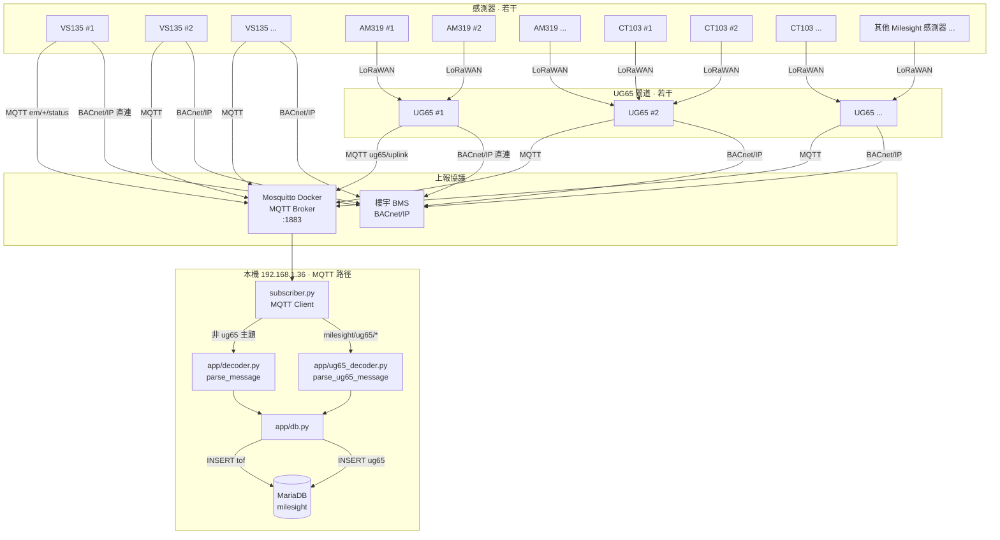
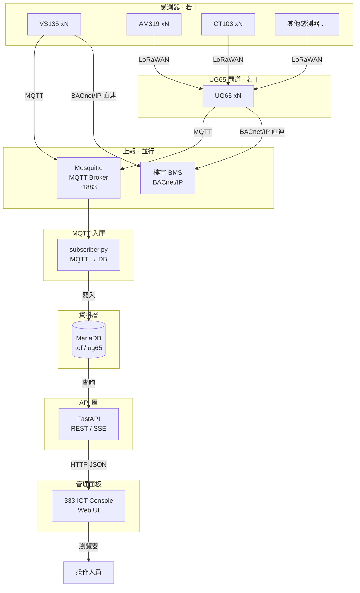

# Milesight MQTT API

English version: [README_en.md](./README_en.md)

接收兩類 MQTT 上報，分表存入 MariaDB：

| 表 | 資料來源 | MQTT 主題 |
|----|----------|-----------|
| `tof` | People Counter / TOF（直連 MQTT） | `em/+/status` |
| `ug65` | UG65 / UG56 閘道 LoRaWAN 轉發（AM319 / CT103 等） | `milesight/ug65/uplink/+`、`milesight/ug56/uplink/+` |

## 架構

### 現況（MQTT → 資料庫）

感測器與 UG65 閘道皆為**若干台**：圖中僅示意少數節點（`#1 / #2 / ...`）。



> **BACnet** 位於設備上報側（與 MQTT 發布同一層）：**若干台 VS135** 與 **若干台 UG65** 可**直接以 BACnet/IP 對接 BMS**。本專案的 Console / API 仍走 MQTT → Mosquitto → `subscriber.py` → MariaDB。

### 規劃中（FastAPI + 管理面板）

管理面板名稱：**333 IOT Console**。



**規劃職責劃分：**

| 組件 | 職責 |
|------|------|
| Mosquitto | **MQTT Broker**（服務端），轉發主題消息 |
| VS135 xN / UG65 xN | **若干**設備／閘道；經 **MQTT** 及／或 **BACnet/IP** 上報（直連 BMS） |
| AM319 / CT103 / 其他感測器 xN | **若干** LoRaWAN 感測器 → UG65；再由 UG65 轉發（MQTT 及／或 BACnet） |
| 設備 / `subscriber.py` | **MQTT Client**；發布或訂閱 |
| `subscriber.py` | 持續訂閱 MQTT、解析、寫入 DB（維持現狀） |
| **FastAPI** | 查詢 `tof` / `ug65`、設備列表、簡易統計、健康檢查 |
| **333 IOT Console** | 瀏覽最新上報、按設備／時間篩選、圖表與狀態 |
| **樓宇 BMS** | 經 BACnet/IP 直接接收 **VS135** / **UG65** 點位 |

> FastAPI 只讀庫（下發可後續再加），不替代 MQTT subscriber，避免入庫邏輯與 Web 耦合。  
> **BACnet 不在資料庫之後**：它是與 MQTT 並列的設備／閘道上報選項；本堆疊目前只消費 MQTT 路徑。  
> 圖中 `#1 / #2 / ...` 或 `xN` 表示**若干台**，僅為示意，非固定數量。

## 重要：感測器 MQTT 主機填什麼？

感測器在 `192.168.1.100`，**不能填 `127.0.0.1`**（那是感測器自己）。

請填**運行 Docker 的這台電腦區網 IP**，例如：

| 項目 | 建議值 |
|------|--------|
| 主機 (Broker Address) | `192.168.1.36` |
| 端口 (Port) | `1883` |
| 客戶端 ID (Client ID) | `milesight-tof-<設備SN>`（需唯一） |
| 用戶名 | `root` |
| 密碼 | `root` |
| 主題 (Topic) | `em/<設備SN>/status` |
| QoS | `1` |
| TLS | **關閉** |

> Milesight EM400 TOF 預設上報主題為 `em/[SN]/status`，請將 `[SN]` 換成設備序列號。

## 快速開始

### 1. 啟動 MQTT Broker

```powershell
cd mqttapi

# Windows 首次需生成可讀的 passwd（Mosquitto 以 mosquitto 用戶運行）
docker run --rm -v "${PWD}/mosquitto:/mosquitto/config" eclipse-mosquitto:2 sh -c "rm -f /mosquitto/config/passwd && mosquitto_passwd -b -c /mosquitto/config/passwd root root && chmod 644 /mosquitto/config/passwd"

docker compose up -d
```

### 2. 初始化 MariaDB

```powershell
copy .env.example .env
pip install -r requirements.txt
python init_db.py
```

### 3. 啟動訂閱服務

```powershell
python subscriber.py
```

### 4. 啟動 FastAPI（IOT Console 後端）

另開終端：

```powershell
python api_server.py
```

- Swagger 文件：`http://127.0.0.1:8000/docs`
- 健康檢查：`http://127.0.0.1:8000/health`
- 統計：`http://127.0.0.1:8000/api/v1/stats`

主要 API：

| 方法 | 路徑 | 說明 |
|------|------|------|
| GET | `/health` | 服務與資料庫狀態 |
| GET | `/api/v1/stats` | tof / ug65 筆數與最近上報時間 |
| GET | `/api/v1/tof` | People Counter 列表（`device_sn` / `since` / `until` / `limit` / `offset`） |
| GET | `/api/v1/tof/devices` | TOF 設備清單 |
| GET | `/api/v1/tof/{id}` | 單筆 TOF |
| GET | `/api/v1/ug65` | UG65 上報列表（`dev_eui` / `since` / `until` / `limit` / `offset`） |
| GET | `/api/v1/ug65/devices` | UG65 設備清單 |
| GET | `/api/v1/ug65/{id}` | 單筆 UG65 |

### 5. 測試發布（可選）

另開終端：

```powershell
python publisher_test.py --distance 1800 --temperature 24.5
```

查詢資料：

```powershell
docker exec mariadb mariadb -uroot -proot -e "SELECT id,received_at,device_sn,distance_mm,temperature_c,battery_pct FROM milesight.tof ORDER BY id DESC LIMIT 10;"
```

## People Counter / TOF 設備 MQTT 設定

在 `http://192.168.1.100/#/communicate/recipient` 填入：

1. **應用模式**：MQTT
2. **Broker 地址**：`192.168.1.36`（你的 PC 區網 IP，非 127.0.0.1）
3. **端口**：`1883`
4. **Client ID**：例如 `em400-tof-6748d11290120003`
5. **用戶憑證**：啟用
6. **用戶名 / 密碼**：`root` / `root`
7. **主題**：`em/<你的設備SN>/status`
8. **QoS**：`1`
9. **TLS**：關閉

保存後，感測器應能連上 Broker；`subscriber.py` 會自動入庫。

## 資料表結構

`tof` 表同時支援 **People Counter 結構化 JSON** 與 **EM400 距離感測器** 兩種上報格式，並保留 `payload_json`、`raw_message` 完整原始資料。

### Device Info（`device_info`）

| 欄位 | JSON 鍵 | id=2 範例 |
|------|---------|-----------|
| device_name | device_info.device_name | People Counter |
| device_sn | device_info.device_sn | 6767E21831900021 |
| device_mac | device_info.device_mac | 24:E1:24:FA:68:E4 |
| wlan_mac | device_info.wlan_mac | 24:E1:24:FA:68:E5 |
| ip_address | device_info.ip_address | 192.168.1.100 |
| custom_device_id | device_info.custom_device_id | （未勾選時為空） |
| custom_site_id | device_info.custom_site_id | （未勾選時為空） |
| running_time_sec | device_info.running_time | 1325 |
| firmware_version | device_info.firmware_version | V_135.1.0.7-r1 |
| hardware_version | device_info.hardware_version | V1.1 |

### Time Info（`time_info`）

| 欄位 | JSON 鍵 | id=2 範例 |
|------|---------|-----------|
| trigger_time | time_info.trigger_time | （未勾選時為空） |
| start_time | time_info.start_time | 2026-07-16 06:40:00 |
| end_time | time_info.end_time | 2026-07-16 06:41:00 |
| time_zone | time_info.time_zone | UTC-0:00 WET/GMT |
| dst_enable | time_info.enable_dst | 0 |
| dst_status | time_info.dst_status | 0 |

### 陣列型上報區塊（JSON 欄位）

勾選後寫入對應 JSON 欄位，未勾選則為 NULL：

| 後台選項 | 資料表欄位 |
|----------|------------|
| Line Trigger Data | line_trigger_data |
| Region Trigger Data | region_trigger_data |
| Region Count Data | region_count_data |
| Dwell Time Data | dwell_time_data |
| Dwell Start Time | dwell_start_time |
| Line Periodic Data | line_periodic_data |
| Line Total Data | line_total_data |
| Line Count Data | line_count_data |
| Region Periodic Data | region_periodic_data |
| Alarm Data | alarm_data |

id=2 實際上報內容：

- **line_periodic_data**：本週期 in=0, out=0（Line1）
- **line_total_data**：累計 in=12, out=14, capacity_counted=-2（Line1）

### 清理與回填

若發現 `device_name`、`start_time` 等欄位為 NULL，但 `payload_json` 有完整資料（通常是舊版 subscriber 仍在運行）：

```powershell
python migrate_v2.py      # 全量回填
python cleanup_tof.py     # 回填不完整記錄 + 刪除 publisher_test 假資料
```

**正常 NULL（非錯誤）**：People Counter 未上報的欄位會是 NULL，例如 `distance_mm`、`battery_pct`、`custom_device_id`、`trigger_time`、`alarm_data` 等。

### 常用查詢

```sql
SELECT id, received_at, device_name, device_sn,
       start_time, end_time,
       JSON_EXTRACT(line_total_data, '$[0].in_counted') AS in_counted,
       JSON_EXTRACT(line_total_data, '$[0].out_counted') AS out_counted,
       JSON_EXTRACT(line_total_data, '$[0].capacity_counted') AS capacity
FROM milesight.tof
WHERE device_sn = '6767E21831900021'
ORDER BY id DESC LIMIT 10;
```

## Python 依賴

- [paho-mqtt](https://pypi.org/project/paho-mqtt/) — MQTT 客戶端
- PyMySQL — MariaDB 連線
- python-dotenv — 環境變數
- FastAPI / Uvicorn — REST API（IOT Console 後端）

## 環境變數（`.env`）

見 `.env.example`。預設訂閱主題為 `em/+/status`；閘道為 `milesight/ug65/uplink/+` 與 `milesight/ug56/uplink/+`（同入 `ug65` 表）。

## 防火牆

確保本機 Windows 防火牆允許入站 **TCP 1883**，否則設備無法連上 Broker。

## Ubuntu 單機部署（Mosquitto + Nginx + Console）

同一台 Ubuntu 跑 MQTT、FastAPI、前端時，見：

**[deploy/ubuntu/Architecture_and_Deployment_readme_zh-HK.md](./deploy/ubuntu/Architecture_and_Deployment_readme_zh-HK.md)** · [EN](./deploy/ubuntu/Architecture_and_Deployment_readme_en.md)

內含 **apt 本機 Mosquitto**（不用 Docker）、Nginx 站點與 systemd 服務範本（MQTT `:1883` 直連，Web 走 Nginx `:80`）。
