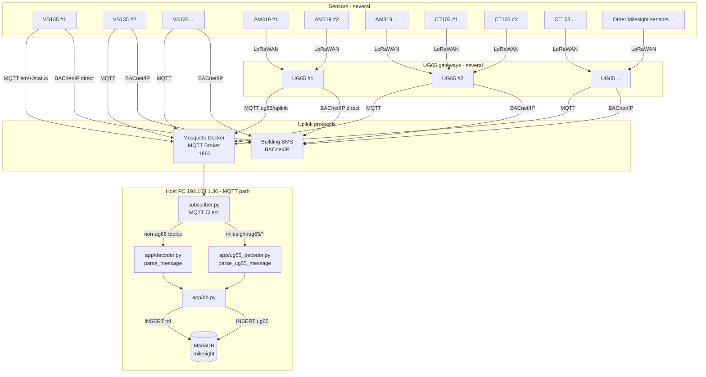
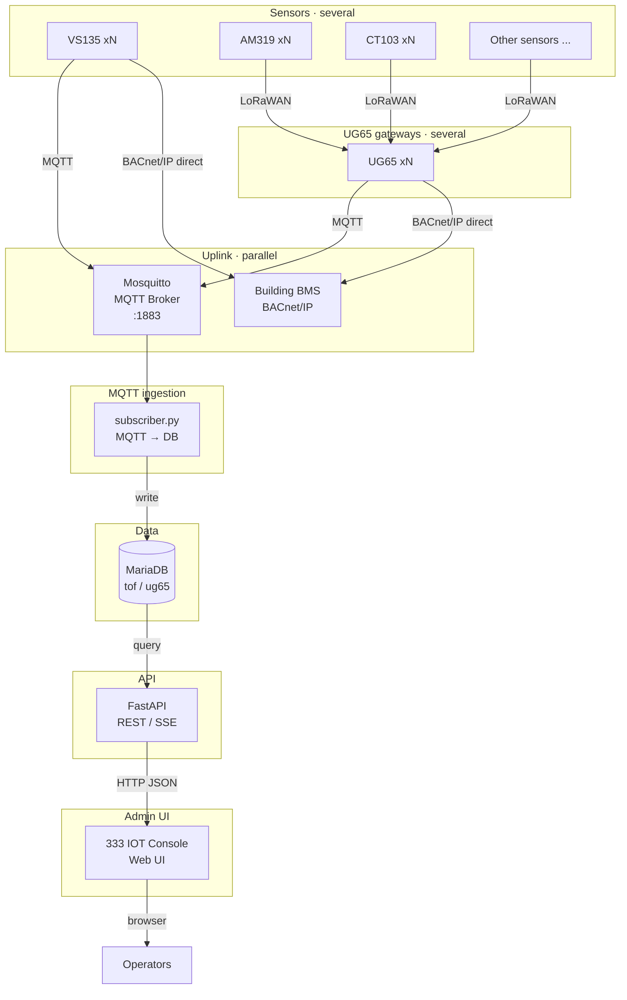

# Milesight MQTT API

Ingest two kinds of MQTT uplinks and store them in separate MariaDB tables:

| Table | Source | MQTT topic |
|-------|--------|------------|
| `tof` | People Counter / TOF (direct MQTT) | `em/+/status` |
| `ug65` | UG65 gateway LoRaWAN forward (AM130 / CT103, etc.) | `milesight/ug65/uplink/+` |

Chinese version: [README.md](./README.md)

## Architecture

### Current (MQTT → database)

Sensors and UG65 gateways are **several**: diagrams show a few examples only (`#1 / #2 / ...`).



> **BACnet** is on the device uplink side (same layer as MQTT): **several VS135** and **several UG65** units can connect **directly to BACnet/IP BMS**. MQTT → Mosquitto → `subscriber.py` → MariaDB is the path used by this console/API stack.

### Planned (FastAPI + admin UI)



**Planned responsibilities:**

| Component | Role |
|-----------|------|
| Mosquitto | **MQTT Broker** (server); routes topic messages |
| VS135 xN / UG65 xN | **Several** devices/gateways; uplink via **MQTT** and/or **BACnet/IP** (direct to BMS) |
| AM319 / CT103 / other sensors xN | **Several** LoRaWAN sensors → UG65; then UG65 forwards (MQTT and/or BACnet) |
| Devices / `subscriber.py` | **MQTT Client**; publish or subscribe |
| `subscriber.py` | Keep subscribing MQTT, decode, insert into DB (as today) |
| **FastAPI** | Query `tof` / `ug65`, device list, simple stats, health checks |
| **333 IOT Console** | Browse latest uplinks, filter by device/time, charts and status |
| **Building BMS** | Receives points directly from **VS135** / **UG65** over BACnet/IP |

> FastAPI should read the database (downlink can come later). It does not replace the MQTT subscriber, so ingestion stays decoupled from the web layer.  
> **BACnet is not after the DB**: it is a device/gateway uplink option alongside MQTT. This stack only consumes the MQTT path today.  
> Nodes marked `#1 / #2 / ...` or `xN` mean **several** — illustrative, not a fixed count.

## Important: what broker host should the sensor use?

The sensor is at `192.168.1.100`. **Do not use `127.0.0.1`** (that is the sensor itself).

Use the **LAN IP of the PC running Docker**, for example:

| Field | Suggested value |
|-------|-----------------|
| Broker Address | `192.168.1.36` |
| Port | `1883` |
| Client ID | `milesight-tof-<device SN>` (must be unique) |
| Username | `root` |
| Password | `root` |
| Topic | `em/<device SN>/status` |
| QoS | `1` |
| TLS | **Off** |

> Milesight EM400 TOF default uplink topic is `em/[SN]/status`. Replace `[SN]` with the device serial number.

## Quick start

### 1. Start the MQTT broker

```powershell
cd mqttapi

# First-time on Windows: create a readable passwd (Mosquitto runs as user mosquitto)
docker run --rm -v "${PWD}/mosquitto:/mosquitto/config" eclipse-mosquitto:2 sh -c "rm -f /mosquitto/config/passwd && mosquitto_passwd -b -c /mosquitto/config/passwd root root && chmod 644 /mosquitto/config/passwd"

docker compose up -d
```

### 2. Initialize MariaDB

```powershell
copy .env.example .env
pip install -r requirements.txt
python init_db.py
```

### 3. Start the subscriber

```powershell
python subscriber.py
```

### 4. Start FastAPI (IOT Console backend)

In another terminal:

```powershell
python api_server.py
```

- Swagger docs: `http://127.0.0.1:8000/docs`
- Health: `http://127.0.0.1:8000/health`
- Stats: `http://127.0.0.1:8000/api/v1/stats`

Main endpoints:

| Method | Path | Description |
|--------|------|-------------|
| GET | `/health` | Service and DB status |
| GET | `/api/v1/stats` | Row counts and last uplink times |
| GET | `/api/v1/tof` | People Counter list (`device_sn` / `since` / `until` / `limit` / `offset`) |
| GET | `/api/v1/tof/devices` | TOF device list |
| GET | `/api/v1/tof/{id}` | Single TOF row |
| GET | `/api/v1/ug65` | UG65 uplink list (`dev_eui` / `since` / `until` / `limit` / `offset`) |
| GET | `/api/v1/ug65/devices` | UG65 device list |
| GET | `/api/v1/ug65/{id}` | Single UG65 row |

### 5. Test publish (optional)

In another terminal:

```powershell
python publisher_test.py --distance 1800 --temperature 24.5
```

Query data:

```powershell
docker exec mariadb mariadb -uroot -proot -e "SELECT id,received_at,device_sn,distance_mm,temperature_c,battery_pct FROM milesight.tof ORDER BY id DESC LIMIT 10;"
```

## People Counter / TOF device MQTT settings

On `http://192.168.1.100/#/communicate/recipient`:

1. **Application mode**: MQTT
2. **Broker address**: `192.168.1.36` (your PC LAN IP, not 127.0.0.1)
3. **Port**: `1883`
4. **Client ID**: e.g. `em400-tof-6748d11290120003`
5. **User credentials**: enable
6. **Username / password**: `root` / `root`
7. **Topic**: `em/<your device SN>/status`
8. **QoS**: `1`
9. **TLS**: off

After saving, the device should connect to the broker; `subscriber.py` will persist uplinks automatically.

## Table schema

The `tof` table supports both **People Counter structured JSON** and **EM400 distance sensor** formats, and always keeps `payload_json` and `raw_message`.

### Device Info (`device_info`)

| Column | JSON key | Example (id=2) |
|--------|----------|----------------|
| device_name | device_info.device_name | People Counter |
| device_sn | device_info.device_sn | 6767E21831900021 |
| device_mac | device_info.device_mac | 24:E1:24:FA:68:E4 |
| wlan_mac | device_info.wlan_mac | 24:E1:24:FA:68:E5 |
| ip_address | device_info.ip_address | 192.168.1.100 |
| custom_device_id | device_info.custom_device_id | (null if not selected) |
| custom_site_id | device_info.custom_site_id | (null if not selected) |
| running_time_sec | device_info.running_time | 1325 |
| firmware_version | device_info.firmware_version | V_135.1.0.7-r1 |
| hardware_version | device_info.hardware_version | V1.1 |

### Time Info (`time_info`)

| Column | JSON key | Example (id=2) |
|--------|----------|----------------|
| trigger_time | time_info.trigger_time | (null if not selected) |
| start_time | time_info.start_time | 2026-07-16 06:40:00 |
| end_time | time_info.end_time | 2026-07-16 06:41:00 |
| time_zone | time_info.time_zone | UTC-0:00 WET/GMT |
| dst_enable | time_info.enable_dst | 0 |
| dst_status | time_info.dst_status | 0 |

### Array uplink sections (JSON columns)

Written when selected in the device UI; otherwise `NULL`:

| UI option | Table column |
|-----------|--------------|
| Line Trigger Data | line_trigger_data |
| Region Trigger Data | region_trigger_data |
| Region Count Data | region_count_data |
| Dwell Time Data | dwell_time_data |
| Dwell Start Time | dwell_start_time |
| Line Periodic Data | line_periodic_data |
| Line Total Data | line_total_data |
| Line Count Data | line_count_data |
| Region Periodic Data | region_periodic_data |
| Alarm Data | alarm_data |

Example content from id=2:

- **line_periodic_data**: period in=0, out=0 (Line1)
- **line_total_data**: cumulative in=12, out=14, capacity_counted=-2 (Line1)

### Cleanup and backfill

If flattened columns such as `device_name` or `start_time` are `NULL` while `payload_json` is complete (often because an old subscriber was still running):

```powershell
python migrate_v2.py      # full backfill
python cleanup_tof.py     # backfill incomplete rows + remove publisher_test fakes
```

**Expected NULL (not an error):** fields the People Counter does not report, e.g. `distance_mm`, `battery_pct`, `custom_device_id`, `trigger_time`, `alarm_data`.

### Useful query

```sql
SELECT id, received_at, device_name, device_sn,
       start_time, end_time,
       JSON_EXTRACT(line_total_data, '$[0].in_counted') AS in_counted,
       JSON_EXTRACT(line_total_data, '$[0].out_counted') AS out_counted,
       JSON_EXTRACT(line_total_data, '$[0].capacity_counted') AS capacity
FROM milesight.tof
WHERE device_sn = '6767E21831900021'
ORDER BY id DESC LIMIT 10;
```

## Python dependencies

- [paho-mqtt](https://pypi.org/project/paho-mqtt/) — MQTT client
- PyMySQL — MariaDB connection
- python-dotenv — environment variables
- FastAPI / Uvicorn — REST API (IOT Console backend)

## Environment variables (`.env`)

See `.env.example`. Default subscribe topic is `em/+/status`; UG65 uses `milesight/ug65/uplink/+`.

## Firewall

Allow inbound **TCP 1883** on the Windows host firewall, or devices cannot reach the broker.

## Ubuntu single-host deploy (Mosquitto + Nginx + Console)

To run MQTT, FastAPI, and the web console on one Ubuntu machine, see:

**[deploy/ubuntu/Architecture_and_Deployment_readme_en.md](./deploy/ubuntu/Architecture_and_Deployment_readme_en.md)** · [中文](./deploy/ubuntu/Architecture_and_Deployment_readme_zh-HK.md)

Includes **native apt Mosquitto** (no Docker), Nginx site config, and systemd unit templates (MQTT `:1883` direct; Web via Nginx `:80`).
