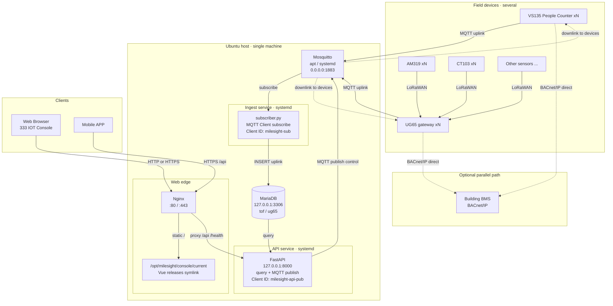

# Architecture & Deploy (Ubuntu): Mosquitto (apt) + Nginx + 333 IOT Console

Chinese (Hong Kong Traditional): [架構與部署_readme.md](./架構與部署_readme.md)

## System architecture



**Data-flow summary:**

| Path | Flow |
|------|------|
| Device uplink | VS135 / UG65 → **MQTT :1883** → Mosquitto → `subscriber.py` → MariaDB |
| **Web** | Browser → **Nginx** → 333 IOT Console; query/control via `/api` → FastAPI (control then MQTT Publish) |
| **Mobile APP** | Mobile APP → **Nginx `/api`** → FastAPI → MariaDB; control: FastAPI → **MQTT Publish** → Mosquitto → devices |
| BACnet (optional) | VS135 / UG65 **direct to BMS** (dashed); not via this stack |

**Process boundaries (keep separate):**

| Service | systemd unit | Role |
|---------|----------------|------|
| MQTT ingest | `milesight-mqtt-subscriber` | Subscribe uplink only, decode, write DB |
| Web API | `milesight-api` | Shared HTTP for **Web Console + Mobile APP**; MQTT downlink publish |
| Mosquitto | `mosquitto` | Broker; MQTT connection management and topic-based routing |
| Nginx | `nginx` | Console static files + reverse proxy `/api` (Web and Mobile APP) |

### Ports and processes

| Port | Service | Notes |
|------|---------|--------|
| **1883** | Mosquitto (**native apt**, no Docker) | Devices connect **directly**; subscriber / API-publisher use `127.0.0.1` on the host |
| **80** (optional 443) | Nginx | Console static + reverse proxy to FastAPI (**Web Browser and Mobile APP**) |
| **8000** | FastAPI | `127.0.0.1` only; proxied by Nginx |
| **3306** | MariaDB | Prefer localhost only |

### Assumed paths (edit configs if different)

| Item | Path |
|------|------|
| Project | `/opt/milesight/MilesightAnalysis` |
| Python venv | `/opt/milesight/venv` |
| Console releases | `/opt/milesight/console/releases/<version>/` |
| Console current | `/opt/milesight/console/current` → active release (Nginx `root`) |
| mqttapi `.env` | `/opt/milesight/MilesightAnalysis/mqttapi/.env` (outside releases) |
| Mosquitto config | `/etc/mosquitto/conf.d/milesight.conf` |
| Mosquitto password file | `/etc/mosquitto/passwd` |

---

## 0. System prep

```bash
sudo apt update
sudo apt install -y nginx mosquitto mosquitto-clients \
  mariadb-server python3-venv python3-pip rsync
sudo systemctl enable --now nginx mosquitto mariadb

# App user (do not run the app as root)
sudo useradd -r -m -d /opt/milesight -s /bin/bash milesight || true
```

Place the code at `/opt/milesight/MilesightAnalysis` (git clone / scp), then:

```bash
sudo chown -R milesight:milesight /opt/milesight
```

> **Mosquitto does not use Docker.** This guide uses `apt install mosquitto` + systemd.

---

## 1. MariaDB (local)

```bash
sudo mysql -e "CREATE DATABASE IF NOT EXISTS milesight CHARACTER SET utf8mb4 COLLATE utf8mb4_unicode_ci;"
sudo mysql -e "CREATE USER IF NOT EXISTS 'root'@'127.0.0.1' IDENTIFIED BY 'root';"
# If root is unix_socket only, create an app user, e.g.:
# sudo mysql -e "CREATE USER IF NOT EXISTS 'milesight'@'127.0.0.1' IDENTIFIED BY 'YOUR_DB_PASSWORD';"
# sudo mysql -e "GRANT ALL ON milesight.* TO 'milesight'@'127.0.0.1'; FLUSH PRIVILEGES;"

cd /opt/milesight/MilesightAnalysis/mqttapi
sudo -u milesight cp -n .env.example .env
# Edit .env:
#   MQTT_HOST=127.0.0.1
#   MQTT_PORT=1883
#   MQTT_USERNAME / MQTT_PASSWORD must match Mosquitto passwd
#   DB_HOST=127.0.0.1
```

Prefer MariaDB listening on localhost only (`bind-address = 127.0.0.1`).

---

## 2. Mosquitto (apt / systemd, not Docker)

### 2.1 Install (skip if done in step 0)

```bash
sudo apt install -y mosquitto mosquitto-clients
sudo systemctl enable --now mosquitto
```

### 2.2 Apply project config

Ubuntu Mosquitto loads `/etc/mosquitto/conf.d/*.conf`.

```bash
sudo cp /opt/milesight/MilesightAnalysis/mqttapi/deploy/ubuntu/mosquitto/milesight.conf \
  /etc/mosquitto/conf.d/milesight.conf

# Create password file (use a strong password in production; -c overwrites the file)
sudo mosquitto_passwd -b -c /etc/mosquitto/passwd root root
sudo chown root:mosquitto /etc/mosquitto/passwd
sudo chmod 640 /etc/mosquitto/passwd

# If the default site conflicts with a custom listener, check:
#   /etc/mosquitto/mosquitto.conf
#   /etc/mosquitto/conf.d/default.conf  (exists on some versions)
# Ensure a single listener on 1883 and allow_anonymous false

sudo mosquitto -c /etc/mosquitto/mosquitto.conf -v   # optional: syntax check, then Ctrl+C
sudo systemctl restart mosquitto
sudo systemctl status mosquitto --no-pager
```

Key settings (see `deploy/ubuntu/mosquitto/milesight.conf`):

- `listener 1883 0.0.0.0` — LAN devices can connect
- `allow_anonymous false`
- `password_file /etc/mosquitto/passwd`
- `persistence_location /var/lib/mosquitto/`

### 2.3 Verify

```bash
ss -lntp | grep 1883   # expect 0.0.0.0:1883 or *:1883

mosquitto_sub -h 127.0.0.1 -p 1883 -u root -P root -t 'milesight/ug65/uplink/+' -v
# another terminal:
mosquitto_pub -h 127.0.0.1 -p 1883 -u root -P root \
  -t 'milesight/ug65/uplink/test' -m '{"ping":1}' -q 1
```

### 2.4 Firewall

```bash
sudo ufw allow 1883/tcp
sudo ufw allow 80/tcp
# sudo ufw allow 443/tcp
sudo ufw enable
sudo ufw status
```

On devices, set Broker to **this Ubuntu LAN IP**, port `1883` (not `127.0.0.1`).

Common issues:

| Symptom | Fix |
|---------|-----|
| `Address already in use` | Ensure no Docker Mosquitto: `docker ps`, stop anything on 1883 |
| Auth failure | passwd path, mode `640`, owner `root:mosquitto` |
| Localhost-only connectivity | Listen on `0.0.0.0` and allow 1883 in ufw |

---

## 3. Python: venv + init + services

```bash
sudo -u milesight python3 -m venv /opt/milesight/venv
sudo -u milesight /opt/milesight/venv/bin/pip install -U pip
sudo -u milesight /opt/milesight/venv/bin/pip install -r /opt/milesight/MilesightAnalysis/mqttapi/requirements.txt

cd /opt/milesight/MilesightAnalysis/mqttapi
sudo -u milesight /opt/milesight/venv/bin/python init_db.py
```

Install systemd units:

```bash
sudo cp /opt/milesight/MilesightAnalysis/mqttapi/deploy/ubuntu/systemd/milesight-api.service /etc/systemd/system/
sudo cp /opt/milesight/MilesightAnalysis/mqttapi/deploy/ubuntu/systemd/milesight-mqtt-subscriber.service /etc/systemd/system/

# If paths are not /opt/milesight/..., edit the two .service files first
sudo systemctl daemon-reload
sudo systemctl enable --now milesight-api milesight-mqtt-subscriber
sudo systemctl status milesight-api milesight-mqtt-subscriber --no-pager
```

**Important:** run **only one** `milesight-mqtt-subscriber` instance; `.env` `MQTT_CLIENT_ID` must be unique on the broker.

Smoke-test API locally:

```bash
curl -s http://127.0.0.1:8000/health
curl -s http://127.0.0.1:8000/api/v1/stats
```

---

## 4. First Console publish + Nginx

First build and point `current` (later releases: **§7**):

```bash
sudo mkdir -p /opt/milesight/console/releases
VER="console-$(date +%Y%m%d)_01"
sudo mkdir -p "/opt/milesight/console/releases/${VER}"

cd /opt/milesight/MilesightAnalysis/frontend
# Node 18+ recommended
npm ci
npm run build
sudo rsync -a --delete dist/ "/opt/milesight/console/releases/${VER}/"
sudo ln -sfn "/opt/milesight/console/releases/${VER}" /opt/milesight/console/current
sudo chown -R www-data:www-data /opt/milesight/console
```

Frontend `VITE_API_BASE_URL=/` (default); the browser calls same-origin `/api`, proxied by Nginx to FastAPI.

```bash
sudo cp /opt/milesight/MilesightAnalysis/mqttapi/deploy/ubuntu/nginx/333-iot-console.conf \
  /etc/nginx/sites-available/333-iot-console.conf
sudo ln -sf /etc/nginx/sites-available/333-iot-console.conf /etc/nginx/sites-enabled/
# optional: sudo rm -f /etc/nginx/sites-enabled/default
sudo nginx -t
sudo systemctl reload nginx
```

Open: `http://<ubuntu-lan-ip>/`

---

## 5. Day-to-day ops

```bash
# Logs
sudo journalctl -u mosquitto -f
sudo journalctl -u milesight-api -f
sudo journalctl -u milesight-mqtt-subscriber -f

# Restart backends
sudo systemctl restart mosquitto
sudo systemctl restart milesight-api milesight-mqtt-subscriber

# Update frontend / API / MQTT: see §7 Versioning
```

---

## 6. HTTPS (optional)

```bash
sudo apt install -y certbot python3-certbot-nginx
sudo certbot --nginx -d your.domain.com
```

On LAN-only setups you may use a self-signed cert, or stay on HTTP:80 for now.

---

## 7. Versioning

Update strategies differ: **Console** uses `releases` + `current` symlink (fast rollback); **API** and **MQTT subscriber** share the git tree and need a systemd restart (symlink alone cannot hot-swap loaded Python).

| Part | Artifact | How to update | Restart needed? |
|------|----------|---------------|-----------------|
| Console | Static `dist/` | `releases/<ver>` + `current` symlink | Nginx usually not (optional reload) |
| Web API | `mqttapi` Python | git pull / checkout tag → restart | **Yes** `milesight-api` |
| MQTT subscriber | Same repo | Same commit as API → restart | **Yes** `milesight-mqtt-subscriber` |
| Mosquitto | apt package + conf | `apt` / edit conf | `systemctl restart mosquitto` (not app release) |

Do **not** bake `.env`, Mosquitto `passwd`, or MariaDB data into each Console release directory.

### 7.1 Console: `releases` directory and `current` switch

Layout:

```text
/opt/milesight/console/
  releases/
    console-20260720_01/
    console-20260720_02/
  current → releases/console-20260720_02
```

Nginx `root` is `/opt/milesight/console/current` (see `nginx/333-iot-console.conf`).

**Publish a new version:**

```bash
# 1) Fetch code (example: git repo already on the server)
cd /opt/milesight/MilesightAnalysis
sudo -u milesight git fetch --tags
# sudo -u milesight git checkout <tag-or-branch>

# 2) Build
cd frontend
sudo -u milesight npm ci
sudo -u milesight npm run build

# 3) Copy into a new release (name is arbitrary)
VER="console-$(date +%Y%m%d)_$(date +%H%M)"
sudo mkdir -p "/opt/milesight/console/releases/${VER}"
sudo rsync -a --delete dist/ "/opt/milesight/console/releases/${VER}/"
sudo chown -R www-data:www-data "/opt/milesight/console/releases/${VER}"

# 4) Atomically switch current (prefer absolute path)
sudo ln -sfn "/opt/milesight/console/releases/${VER}" /opt/milesight/console/current

# 5) Optional: reload nginx
sudo nginx -t && sudo systemctl reload nginx

# Verify
readlink -f /opt/milesight/console/current
ls -la /opt/milesight/console/
```

**Roll back:**

```bash
ls -1 /opt/milesight/console/releases/
# pick an older dir, e.g. console-20260720_01
sudo ln -sfn /opt/milesight/console/releases/console-20260720_01 /opt/milesight/console/current
sudo systemctl reload nginx
```

**Prune old releases (keep newest N):**

```bash
cd /opt/milesight/console/releases
ls -1t | tail -n +6 | xargs -r sudo rm -rf
```

### 7.2 Web API: git + systemd restart

API and subscriber share `/opt/milesight/MilesightAnalysis/mqttapi`; **no** separate `releases/api` for now.  
**333 IOT Console (Web)** and **Mobile APP** share the same FastAPI (via Nginx `/api`); downlink control is MQTT publish inside the API, separate from the ingest process.

```bash
cd /opt/milesight/MilesightAnalysis
sudo -u milesight git fetch --tags
sudo -u milesight git checkout <tag-or-commit>   # e.g. v1.2.0

cd mqttapi
sudo -u milesight /opt/milesight/venv/bin/pip install -r requirements.txt
# if DB changed: sudo -u milesight /opt/milesight/venv/bin/python migrate_v2.py

sudo systemctl restart milesight-api
sudo systemctl status milesight-api --no-pager
curl -s http://127.0.0.1:8000/health
```

Rollback: `git checkout <previous-tag>` → `systemctl restart milesight-api` (watch schema compatibility).

### 7.3 MQTT subscriber: restart with the same API version

The subscriber must match decode/write logic; **prefer the same git commit as the API**.

```bash
# after the git checkout above
sudo systemctl restart milesight-mqtt-subscriber
sudo systemctl status milesight-mqtt-subscriber --no-pager
sudo journalctl -u milesight-mqtt-subscriber -n 50 --no-pager
```

Notes:

- Only **one** subscriber on the host (same `MQTT_CLIENT_ID`)
- Brief miss possible during restart; QoS1 usually redelivers; writes should be idempotent
- Do not update Python by symlink switch alone without restart

### 7.4 Suggested release order

1. Update and restart **API** (run migrations first if needed)  
2. Restart **MQTT subscriber** (same commit as API)  
3. Switch Console **`current`** last (API contract ready)  
4. Smoke-test Console and `curl /api/v1/stats`  

---

## 8. Checklist

- [ ] Mosquitto is **apt/systemd**, not Docker: `systemctl status mosquitto`
- [ ] `ss -lntp | grep 1883` → `0.0.0.0:1883`
- [ ] `ss -lntp | grep 8000` → `127.0.0.1:8000`
- [ ] `curl http://127.0.0.1/health` works via Nginx
- [ ] Console opens on LAN; `readlink -f /opt/milesight/console/current` points at the expected release
- [ ] Devices use Ubuntu LAN IP:1883 as MQTT broker
- [ ] Subscriber logs show `[saved]`, and only one instance runs
- [ ] MariaDB is not exposed on the public network on 3306
- [ ] No Docker Mosquitto is holding port 1883

---

## File list

```text
deploy/ubuntu/
  Architecture_and_Deployment_readme_en.md   ← English (this guide)
  架構與部署_readme.md                       ← Chinese (Hong Kong Traditional)
  mosquitto/milesight.conf                   ← apt Mosquitto (→ /etc/mosquitto/conf.d/)
  nginx/333-iot-console.conf                 ← Nginx site (root → console/current)
  systemd/milesight-api.service              ← FastAPI
  systemd/milesight-mqtt-subscriber.service
```

Also see `mqttapi/README_en.md` for device MQTT field notes.
