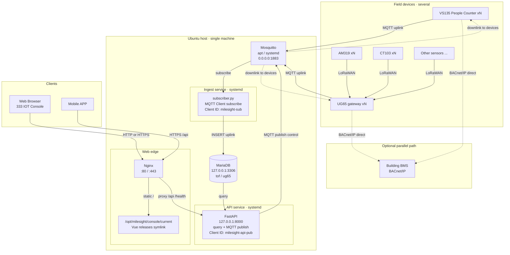

# 架構與部署（Ubuntu）：Mosquitto（apt）+ Nginx + 333 IOT Console

English: [Architecture_and_Deployment_readme_en.md](./Architecture_and_Deployment_readme_en.md)

## 系統架構



**資料流摘要：**

| 路徑 | 流向 |
|------|------|
| 設備上報 | VS135 / UG65 → **MQTT :1883** → Mosquitto → `subscriber.py` → MariaDB |
| **Web** | Browser → **Nginx** → 333 IOT Console；查詢／控制均經 `/api` → FastAPI（控制時再 MQTT Publish） |
| **Mobile APP** | Mobile APP → **Nginx `/api`** → FastAPI → 查 MariaDB；控制時 FastAPI → **MQTT Publish** → Mosquitto → 設備 |
| BACnet（可選） | VS135 / UG65 **直連 BMS**（虛線），不經本堆疊 |

**進程邊界（務必分開）：**

| 服務 | systemd 單元 | 職責 |
|------|----------------|------|
| MQTT 採集 | `milesight-mqtt-subscriber` | 只訂閱上行、解包、寫庫 |
| Web API | `milesight-api` | **Web Console + Mobile APP** 共用 HTTP；MQTT 下行 publish |
| Mosquitto | `mosquitto` | Broker；負責 MQTT 連線管理與依 topic 轉發訊息 |
| Nginx | `nginx` | Console 靜態 + 反代 `/api`（Web 與 Mobile APP） |

### 埠與進程

| 埠 | 服務 | 說明 |
|----|------|------|
| **1883** | Mosquitto（**apt 本機**，不用 Docker） | 設備 MQTT **直連**；subscriber / API-publisher 本機連 `127.0.0.1` |
| **80**（可加 443） | Nginx | Console 靜態 + 反代 FastAPI（**Web Browser 與 Mobile APP**） |
| **8000** | FastAPI | 僅 `127.0.0.1`，由 Nginx 轉發 |
| **3306** | MariaDB | 建議僅本機 |

### 路徑假設（可按實際修改各檔案）


| 項目 | 路徑 |
|------|------|
| 專案 | `/opt/milesight/MilesightAnalysis` |
| Python venv | `/opt/milesight/venv` |
| Console releases | `/opt/milesight/console/releases/<version>/` |
| Console current | `/opt/milesight/console/current` → 當前版本（Nginx `root`） |
| mqttapi `.env` | `/opt/milesight/MilesightAnalysis/mqttapi/.env`（放 releases 外） |
| Mosquitto 設定 | `/etc/mosquitto/conf.d/milesight.conf` |
| Mosquitto 帳密 | `/etc/mosquitto/passwd` |

---

## 0. 系統準備

```bash
sudo apt update
sudo apt install -y nginx mosquitto mosquitto-clients \
  mariadb-server python3-venv python3-pip rsync
sudo systemctl enable --now nginx mosquitto mariadb

# 執行用戶（勿用 root 跑應用）
sudo useradd -r -m -d /opt/milesight -s /bin/bash milesight || true
```

將程式碼放到 `/opt/milesight/MilesightAnalysis`（git clone / scp 皆可），並：

```bash
sudo chown -R milesight:milesight /opt/milesight
```

> **Mosquitto 不使用 Docker。** 本說明以 `apt install mosquitto` + systemd 為準。

---

## 1. MariaDB（本機）

```bash
sudo mysql -e "CREATE DATABASE IF NOT EXISTS milesight CHARACTER SET utf8mb4 COLLATE utf8mb4_unicode_ci;"
sudo mysql -e "CREATE USER IF NOT EXISTS 'root'@'127.0.0.1' IDENTIFIED BY 'root';"
# 若 root 僅 unix_socket，可另建應用帳號，例如：
# sudo mysql -e "CREATE USER IF NOT EXISTS 'milesight'@'127.0.0.1' IDENTIFIED BY 'YOUR_DB_PASSWORD';"
# sudo mysql -e "GRANT ALL ON milesight.* TO 'milesight'@'127.0.0.1'; FLUSH PRIVILEGES;"

cd /opt/milesight/MilesightAnalysis/mqttapi
sudo -u milesight cp -n .env.example .env
# 編輯 .env：
#   MQTT_HOST=127.0.0.1
#   MQTT_PORT=1883
#   MQTT_USERNAME / MQTT_PASSWORD 與 Mosquitto passwd 一致
#   DB_HOST=127.0.0.1
```

建議確認 MariaDB 只聽本機（`bind-address = 127.0.0.1`）。

---

## 2. Mosquitto（apt / systemd，非 Docker）

### 2.1 安裝（若步驟 0 已裝可跳過）

```bash
sudo apt install -y mosquitto mosquitto-clients
sudo systemctl enable --now mosquitto
```

### 2.2 套用專案設定

Ubuntu 的 Mosquitto 會讀取 `/etc/mosquitto/conf.d/*.conf`。

```bash
sudo cp /opt/milesight/MilesightAnalysis/mqttapi/deploy/ubuntu/mosquitto/milesight.conf \
  /etc/mosquitto/conf.d/milesight.conf

# 建立帳密（正式環境請改強密碼；-c 會覆寫檔案）
sudo mosquitto_passwd -b -c /etc/mosquitto/passwd root root
sudo chown root:mosquitto /etc/mosquitto/passwd
sudo chmod 640 /etc/mosquitto/passwd

# 若預設站與自訂 listener 衝突，檢查：
#   /etc/mosquitto/mosquitto.conf
#   /etc/mosquitto/conf.d/default.conf  （部分版本存在）
# 確保最終只有一個 listener 1883，且 allow_anonymous false

sudo mosquitto -c /etc/mosquitto/mosquitto.conf -v   # 可選：語法檢查後 Ctrl+C
sudo systemctl restart mosquitto
sudo systemctl status mosquitto --no-pager
```

關鍵設定（見 `deploy/ubuntu/mosquitto/milesight.conf`）：

- `listener 1883 0.0.0.0` — 區網設備可連
- `allow_anonymous false`
- `password_file /etc/mosquitto/passwd`
- `persistence_location /var/lib/mosquitto/`

### 2.3 驗證

```bash
ss -lntp | grep 1883   # 應看到 0.0.0.0:1883 或 *:1883

mosquitto_sub -h 127.0.0.1 -p 1883 -u root -P root -t 'milesight/ug65/uplink/+' -v
# 另開終端：
mosquitto_pub -h 127.0.0.1 -p 1883 -u root -P root \
  -t 'milesight/ug65/uplink/test' -m '{"ping":1}' -q 1
```

### 2.4 防火牆

```bash
sudo ufw allow 1883/tcp
sudo ufw allow 80/tcp
# sudo ufw allow 443/tcp
sudo ufw enable
sudo ufw status
```

設備 Broker 填 **此 Ubuntu 區網 IP**，埠 `1883`（不要填 `127.0.0.1`）。

常見問題：

| 現象 | 處理 |
|------|------|
| `Address already in use` | 確認未再跑 Docker Mosquitto：`docker ps`，停掉佔用 1883 的容器 |
| 認證失敗 | passwd 路徑、權限 `640`、owner `root:mosquitto` |
| 只有本機能連 | 檢查是否聽 `0.0.0.0`，以及 ufw 是否放行 1883 |

---

## 3. Python：venv + 初始化 + 服務

```bash
sudo -u milesight python3 -m venv /opt/milesight/venv
sudo -u milesight /opt/milesight/venv/bin/pip install -U pip
sudo -u milesight /opt/milesight/venv/bin/pip install -r /opt/milesight/MilesightAnalysis/mqttapi/requirements.txt

cd /opt/milesight/MilesightAnalysis/mqttapi
sudo -u milesight /opt/milesight/venv/bin/python init_db.py
```

安裝 systemd：

```bash
sudo cp /opt/milesight/MilesightAnalysis/mqttapi/deploy/ubuntu/systemd/milesight-api.service /etc/systemd/system/
sudo cp /opt/milesight/MilesightAnalysis/mqttapi/deploy/ubuntu/systemd/milesight-mqtt-subscriber.service /etc/systemd/system/

# 若路徑不是 /opt/milesight/...，先編輯兩個 .service 再 enable
sudo systemctl daemon-reload
sudo systemctl enable --now milesight-api milesight-mqtt-subscriber
sudo systemctl status milesight-api milesight-mqtt-subscriber --no-pager
```

**重要**：`milesight-mqtt-subscriber` **只啟一個實例**；`.env` 的 `MQTT_CLIENT_ID` 在 Broker 上必須唯一。

本機測 API：

```bash
curl -s http://127.0.0.1:8000/health
curl -s http://127.0.0.1:8000/api/v1/stats
```

---

## 4. 前端首次發佈 + Nginx

首次建置並掛上 `current`（後續迭代見 **§7**）：

```bash
sudo mkdir -p /opt/milesight/console/releases
VER="console-$(date +%Y%m%d)_01"
sudo mkdir -p "/opt/milesight/console/releases/${VER}"

cd /opt/milesight/MilesightAnalysis/frontend
# Node 18+ 建議
npm ci
npm run build
sudo rsync -a --delete dist/ "/opt/milesight/console/releases/${VER}/"
sudo ln -sfn "/opt/milesight/console/releases/${VER}" /opt/milesight/console/current
sudo chown -R www-data:www-data /opt/milesight/console
```

前端 `VITE_API_BASE_URL=/`（預設），瀏覽器請求同源 `/api`，由 Nginx 轉到 FastAPI。

```bash
sudo cp /opt/milesight/MilesightAnalysis/mqttapi/deploy/ubuntu/nginx/333-iot-console.conf \
  /etc/nginx/sites-available/333-iot-console.conf
sudo ln -sf /etc/nginx/sites-available/333-iot-console.conf /etc/nginx/sites-enabled/
# 可關掉預設站：sudo rm -f /etc/nginx/sites-enabled/default
sudo nginx -t
sudo systemctl reload nginx
```

瀏覽器開啟：`http://<ubuntu-lan-ip>/`

---

## 5. 日常運維

```bash
# 日誌
sudo journalctl -u mosquitto -f
sudo journalctl -u milesight-api -f
sudo journalctl -u milesight-mqtt-subscriber -f

# 重啟後端
sudo systemctl restart mosquitto
sudo systemctl restart milesight-api milesight-mqtt-subscriber

# 更新前端 / API / MQTT：見 §7 版本迭代
```

---

## 6. HTTPS（可選）

```bash
sudo apt install -y certbot python3-certbot-nginx
sudo certbot --nginx -d your.domain.com
```

僅區網可用自簽證書，或暫時只走 HTTP:80。

---

## 7. 版本迭代

三部分更新策略不同：**Console** 用 `releases` + `current` 符號連結（可秒級回滾）；**API** 與 **MQTT subscriber** 與 git 程式碼同源，更新後需重啟 systemd（符號連結無法熱替換已載入的 Python）。

| 部分 | 產物 | 更新方式 | 是否需重啟 |
|------|------|----------|------------|
| Console | 靜態 `dist/` | `releases/<ver>` + `current` symlink | Nginx 一般不用重啟（reload 可選） |
| Web API | `mqttapi` Python | git pull / checkout tag → restart | **需要** `milesight-api` |
| MQTT subscriber | 同上儲存庫 | 與 API 同一 commit → restart | **需要** `milesight-mqtt-subscriber` |
| Mosquitto | apt 套件 + conf | `apt` / 改 conf | `systemctl restart mosquitto`（非業務發版） |

`.env`、Mosquitto `passwd`、MariaDB **不要**打進每個 Console release 目錄。

### 7.1 Console：`releases` 目錄與 `current` 切換

目錄結構：

```text
/opt/milesight/console/
  releases/
    console-20260720_01/
    console-20260720_02/
  current → releases/console-20260720_02
```

Nginx `root` 指向 `/opt/milesight/console/current`（見 `nginx/333-iot-console.conf`）。

**發佈新版本：**

```bash
# 1) 取程式碼（例子：已在伺服器上的 git 儲存庫）
cd /opt/milesight/MilesightAnalysis
sudo -u milesight git fetch --tags
# sudo -u milesight git checkout <tag-or-branch>

# 2) 建置
cd frontend
sudo -u milesight npm ci
sudo -u milesight npm run build

# 3) 寫入新 release（版本名可自訂）
VER="console-$(date +%Y%m%d)_$(date +%H%M)"
sudo mkdir -p "/opt/milesight/console/releases/${VER}"
sudo rsync -a --delete dist/ "/opt/milesight/console/releases/${VER}/"
sudo chown -R www-data:www-data "/opt/milesight/console/releases/${VER}"

# 4) 原子切換 current（建議用絕對路徑）
sudo ln -sfn "/opt/milesight/console/releases/${VER}" /opt/milesight/console/current

# 5) 可選：reload nginx
sudo nginx -t && sudo systemctl reload nginx

# 確認
readlink -f /opt/milesight/console/current
ls -la /opt/milesight/console/
```

**回滾到上一版：**

```bash
ls -1 /opt/milesight/console/releases/
# 選定舊目錄名，例如 console-20260720_01
sudo ln -sfn /opt/milesight/console/releases/console-20260720_01 /opt/milesight/console/current
sudo systemctl reload nginx
```

**清理舊版本（保留最近 N 個）：**

```bash
cd /opt/milesight/console/releases
ls -1t | tail -n +6 | xargs -r sudo rm -rf
```

### 7.2 Web API：git + systemd 重啟

API 與 subscriber 共用 `/opt/milesight/MilesightAnalysis/mqttapi`，**不**另建 `releases/api`（現階段）。  
**333 IOT Console（Web）** 與 **Mobile APP** 共用同一 FastAPI（經 Nginx `/api`）；下行控制在 API 內 MQTT publish，與採集進程分離。

```bash
cd /opt/milesight/MilesightAnalysis
sudo -u milesight git fetch --tags
sudo -u milesight git checkout <tag-or-commit>   # 例如 v1.2.0

cd mqttapi
sudo -u milesight /opt/milesight/venv/bin/pip install -r requirements.txt
# 若有 DB 變更：sudo -u milesight /opt/milesight/venv/bin/python migrate_v2.py

sudo systemctl restart milesight-api
sudo systemctl status milesight-api --no-pager
curl -s http://127.0.0.1:8000/health
```

回滾：`git checkout <previous-tag>` → 再 `systemctl restart milesight-api`（注意 schema 是否相容）。

### 7.3 MQTT subscriber：與 API 同版本重啟

訂閱進程必須與解碼／寫庫邏輯一致，**建議與 API 同一 git commit** 一併更新。

```bash
# 接上節 git checkout 之後
sudo systemctl restart milesight-mqtt-subscriber
sudo systemctl status milesight-mqtt-subscriber --no-pager
sudo journalctl -u milesight-mqtt-subscriber -n 50 --no-pager
```

注意：

- 全機只跑 **一個** subscriber（同一 `MQTT_CLIENT_ID`）
- 重啟期間可能短暫漏收；設備 QoS1 通常會重傳，寫庫宜冪等
- 不要用「只切 symlink、不重啟」更新 Python

### 7.4 建議發版順序

1. 先更新並重啟 **API**（必要時先跑 migration）  
2. 再重啟 **MQTT subscriber**（與 API 同 commit）  
3. 最後切換 **Console `current`**（前後端契約已就緒）  
4. 用 Console 與 `curl /api/v1/stats` 做冒煙測試  

---

## 8. 檢查清單

- [ ] Mosquitto 為 **apt/systemd**，非 Docker：`systemctl status mosquitto`
- [ ] `ss -lntp | grep 1883` → `0.0.0.0:1883`
- [ ] `ss -lntp | grep 8000` → `127.0.0.1:8000`
- [ ] `curl http://127.0.0.1/health` 經 Nginx 正常
- [ ] 區網可開 Console；`readlink -f /opt/milesight/console/current` 指向預期 release
- [ ] 設備 MQTT 指向 Ubuntu 區網 IP:1883
- [ ] subscriber 日誌有 `[saved]`，且只有一個實例
- [ ] MariaDB 未對公網開放 3306
- [ ] 本機無 Docker Mosquitto 佔用 1883

---

## 檔案一覽

```text
deploy/ubuntu/
  Architecture_and_Deployment_readme_zh-HK.md   ← 本說明（含 §7 版本迭代）
  Architecture_and_Deployment_readme_en.md      ← English
  mosquitto/milesight.conf                      ← apt Mosquitto（→ /etc/mosquitto/conf.d/）
  nginx/333-iot-console.conf                    ← Nginx 站點（root → console/current）
  systemd/milesight-api.service                 ← FastAPI
  systemd/milesight-mqtt-subscriber.service
```

裝置 MQTT 欄位說明亦見 `mqttapi/README.md` / `mqttapi/README_en.md`。
